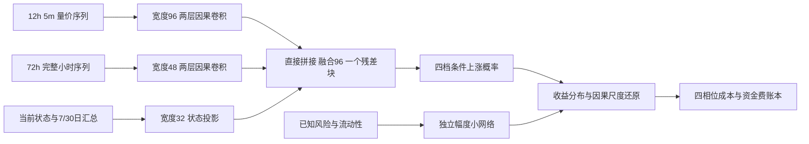

# Crypto Timing Network：12 合约择时研究

本仓库实现从 BigAlpha 股票分钟模型迁移到 12 个加密货币永续合约的择时研究。最新核心版本 v3 根据[预测目标与训练结构重设计](docs/TRAINING_REDESIGN_2026-10-04.md)，改用可执行 4 小时简单收益、独立的条件方向与幅度概率模型，以及按方向增量选权重。**当前策略仍不应部署**：神经网络在 2025-07–10 早停校准期超过线性方向基线，但在 2025-11–2026-01 规则选择期优势反转。完整数字和图表见 [v3 视觉报告](reports/redesign_2026-10-04/index.html) 及 [紧凑报告](reports/redesign_2026-10-04/README.md)。原始数据和模型检查点留在本地 `outputs/`，不进入 Git。

从 [v3 重设计](docs/TRAINING_REDESIGN_2026-10-04.md) 阅读现行核心方案，从 [完整研究报告](docs/V3_RESEARCH_REPORT_2026-10-04.md) 系统了解任务、数据、网络、训练和实证结果，按 [20 个问答](docs/V3_MODEL_STRATEGY_QA.md)理解常见设计取舍，再打开 [v3 可视化报告](reports/redesign_2026-10-04/index.html)查看图表。从 [迁移设计](docs/CRYPTO_TIMING_DESIGN.md)、[数据审计](docs/DATA_AUDIT.md)、[旧训练协议](docs/TRAINING_RUNBOOK.md)、[旧结果报告](reports/2026-10-03/README.md) 及 [训练失效诊断](docs/TRAINING_FAILURE_DIAGNOSIS_2026-10-04.md) 追溯前一版。

> 仓库 URL 沿用指定的 `netrual` 拼写；研究目标是合约**择时**，不是 12 币横截面中性排序。

## 源项目

源项目：`D:/Trading/bigquant`，核查基准提交 `85fd1de`（`feature/unified-alpha-fusion`）。迁移将复用其时间对齐、缺失掩码、多尺度因果卷积、统计分支、冻结输入合同与样本外审计方法；股票特有的盘口、行业、DeepSets 主干和日截面排序目标不直接移植。

数据本地位置：`D:/Trading/practical_crypto_strategy/data/parquet`。原始 Parquet 不进入本仓库。

## 当前研究结果

- 已核对 12 个合约的 Parquet schema、行数、范围、时间网格和衍生字段覆盖率。
- v3 已构建 16 通道 5m 快特征、10 通道 1h 慢特征、24 维当前状态及 10 维风险状态；因果 4h 收益标签按绝对风险调整幅度分四档，并单独监督各档方向。
- v3 训练了三个 101,573 参数的方向网络随机种子和一个 868 参数的独立幅度网络，并与条件方向 logistic、幅度 logistic、直接收益 Ridge 比较。三个方向网络最佳 epoch 分别为 4、3、4；训练损失继续下降时验证损失反弹。
- 在 2025-07–10 早停校准期，方向胜者相对线性 BCE 改善 +0.00373；2025-11–2026-01 规则选择期变为 −0.00251。幅度小网络未稳定超过幅度线性模型。交易规则选择期的经济胜者是线性方向模型，不是方向神经网络。
- 2026-02–09 历史已被旧研究查看，v3 对其结果只标为探索性诊断，不能重新宣称独立测试。确认性结论需要本方案锁定后新到达且未用于研究选择的数据。
- 前一版 11 组 GPU 实验及测试结果仍保留在[旧报告](reports/2026-10-03/README.md)。完整训练日志、预测文件和检查点在本机 `outputs/`；GitHub 保存代码、方法与紧凑结果。

