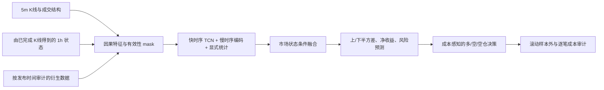

# Crypto Timing Network：研究设计阶段

本仓库实现从 BigAlpha 股票分钟模型迁移到 12 个加密货币永续合约的择时研究。已完成数据合同、因果特征仓、训练器、基线、验证选择与封存测试的代码；研究运行与结果见 [训练记录](docs/TRAINING_RUNBOOK.md) 和完成后的结果报告。原始数据和模型检查点保留在本地 `outputs/`，不进入 Git。

从 [迁移设计](docs/CRYPTO_TIMING_DESIGN.md) 阅读方案，从 [数据审计](docs/DATA_AUDIT.md) 核对实际字段和可用时点，从 [训练记录](docs/TRAINING_RUNBOOK.md) 查看已实现的参数与复现流程。

> 仓库 URL 沿用指定的 `netrual` 拼写；研究目标是合约**择时**，不是 12 币横截面中性排序。

## 源项目

源项目：`D:/Trading/bigquant`，核查基准提交 `85fd1de`（`feature/unified-alpha-fusion`）。迁移将复用其时间对齐、缺失掩码、多尺度因果卷积、统计分支、冻结输入合同与样本外审计方法；股票特有的盘口、行业、DeepSets 主干和日截面排序目标不直接移植。

数据本地位置：`D:/Trading/practical_crypto_strategy/data/parquet`。原始 Parquet 不进入本仓库。

## 当前研究阶段

- 已核对 12 个合约的 Parquet schema、行数、范围、时间网格和衍生字段覆盖率。
- 已生成 5m/1h 多尺度特征仓和多任务标签；网络、线性/树模型与成本账本均有可执行入口。
- 模型结果以冻结验证选择和独立测试记录为准；不能从单个训练损失推断可交易收益。

