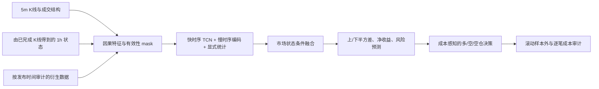

# Crypto Timing Network：12 合约择时研究

本仓库实现从 BigAlpha 股票分钟模型迁移到 12 个加密货币永续合约的择时研究。已完成数据合同、因果特征仓、11 组 GPU 网络训练、基线、验证选择与冻结测试。**当前策略未通过样本外测试，不应部署**：验证期选出的模型在 2026-02 至 2026-09 测试期四相位平均净 Sharpe 为 −1.544，零固定交易成本时仍为 −1.040。详见 [完整研究报告](reports/2026-10-03/README.md)。原始数据和模型检查点留在本地 `outputs/`，不进入 Git。

从 [迁移设计](docs/CRYPTO_TIMING_DESIGN.md) 阅读方案，从 [数据审计](docs/DATA_AUDIT.md) 核对实际字段和可用时点，从 [训练协议](docs/TRAINING_RUNBOOK.md) 查看参数与复现流程，从 [结果报告](reports/2026-10-03/README.md) 查看所有实验和冻结测试，从 [训练失效诊断](docs/TRAINING_FAILURE_DIAGNOSIS_2026-10-04.md) 阅读损失、早停和标签问题的深入分析。

> 仓库 URL 沿用指定的 `netrual` 拼写；研究目标是合约**择时**，不是 12 币横截面中性排序。

## 源项目

源项目：`D:/Trading/bigquant`，核查基准提交 `85fd1de`（`feature/unified-alpha-fusion`）。迁移将复用其时间对齐、缺失掩码、多尺度因果卷积、统计分支、冻结输入合同与样本外审计方法；股票特有的盘口、行业、DeepSets 主干和日截面排序目标不直接移植。

数据本地位置：`D:/Trading/practical_crypto_strategy/data/parquet`。原始 Parquet 不进入本仓库。

## 当前研究结果

- 已核对 12 个合约的 Parquet schema、行数、范围、时间网格和衍生字段覆盖率。
- 已生成 5m/1h 多尺度特征仓和多任务标签，训练 11 组 GPU 网络及线性/树模型和规则基线。
- 验证前段校准、验证后段选择、测试封存评估按预设日期完成。半方差标签的弱预测性未转化为稳定的可执行收益；冻结胜者四种 4h 换仓相位在测试期均亏损。
- 大模型参数、完整训练日志和预测文件在本机 `outputs/`，GitHub 保存代码、方法与紧凑结果。下一阶段的标签或决策修订须在新的独立未来样本中确认。

