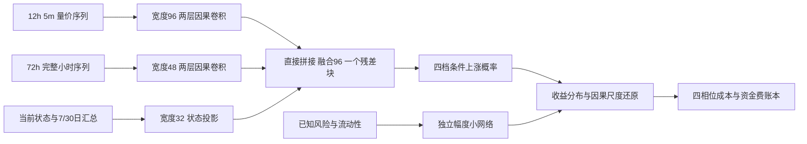

# Crypto Timing Network：12 合约择时研究

当前 GitHub 快照版本：**2026.10.5（2026-10-05）**，分支 `codex/research-2026-10-05`。见[版本说明与已知限制](docs/VERSION_2026-10-05.md)。整体模型架构已完成多轮尝试，但部分时段预测方向、幅度和校准仍存在问题，尚未证明稳定可迁移的预测优势。GitHub 保存代码、文档、重要图表/结果和审计证据；大体量行情、权重、缓存与预测数组留在本地。

## 最新状态 2026-10-05

已新增固定预测的持仓控制研究与兼容实现，**没有重训或重推理网络**。四类中心方案 A/B/C/D、C 附近预算、费用/持有消融及兼容扩展 E 均保留。D 是开发期锁定的活跃研究候选；E 是在 A—D 历史已见后新增的探索性“旧强核心＋小额度弱期参与”，不能冒充未见历史的开发胜者。每侧2bp、零资金费下，E 后续历史净收益 +187.11%、分钟回撤 −21.22%、参与率99.63%、每日换手2.114；弱期实际角色净贡献约 −0.15 个初始权益百分点，整体改善还包括共享调仓时钟对核心入场的影响。

- [持仓控制完整研究 Markdown](docs/SIGNAL_CONTROL_RESEARCH_2026-10-05.md)
- [综合研究 HTML](reports/signal_control_2026-10-05/index.html)
- [十二币真实持仓与信号 HTML](reports/signal_control_2026-10-05/coins.html)
- [比較合同与选择规则修正](docs/SIGNAL_CONTROL_PROTOCOL_2026-10-05.md)

入口 `./scripts/run_signal_control.ps1`（universal 环境；all/test/research/report），36项相关测试与16个完整账户账本核对通过。原策略、模型、预测和既有结果保留；这轮不部署资金。E 仍需独立前向及完整资金费/滑点验证；D 的真实资金费情景不能替代 E。

参与率包含极小仓位，不能解释为始终充分投资。总毛敞口至少净资产1%时，E覆盖57.26%、D87.95%、旧主方案36.83%；E的额度仍集中于强事件。

已完成统一策略研究、开发期锁定主方案、2倍近满仓排名对照及2bp图集。主方案是**原v5锚点＋12h折外期限投影**，不等于原网络已重训为12h模型。[最终核验记录](outputs/alpha_strategy/final_audit.json)保存52项历史检查及账户核对结果；本次文档更新没有重新运行这些检查，也没有部署资金。

- [完整策略研究 Markdown](docs/ALPHA_STRATEGY_RESEARCH_REPORT_2026-10-04.md)
- [综合分析 HTML](reports/alpha_strategy_2026-10-04/index.html)
- [总账户与分币种 HTML 图集](reports/2bp_curve_gallery_2026-10-04/index.html)
- [连续信号到仓位的数学建模与多方案设计](docs/SIGNAL_POSITION_MAPPING_DESIGN_2026-10-05.md)：约1.17万汉字的设计依据，原文只作数学设计；其后的实现与实证见本页新增持仓控制研究，原设计论述保留。

口径确认：现有2bp账本费率不自动改变主方案每侧4bp、往返8bp的设计门槛；分币图集是已存成交路径剔除资金费后的费用重述，不是重新运行的零资金费策略。下一阶段以用户指定的maker单边2bp作为费用假设，实际maker成交能力另行验证。

仓库另有[概率支持度仓位探索](docs/PROBABILITY_POSITION_PROTOCOL_2026-10-04.md)及相关代码/产物，属于历史探索，不自动替代锁定主方案；本次排名底仓设计承接该探索，不覆盖其结果。后续正式交付约定为**一份Markdown研究报告＋一份综合HTML＋一份分币HTML**，共同使用同一结果版本和费用口径。

## 研究沿革

当前最新策略研究依据[v5信息优势与策略设计](docs/V5_INFORMATION_ALPHA_AND_STRATEGY_DESIGN_2026-10-04.md)，复用既有神经网络，在一分钟来源、下一分钟成交、四期限目标和统一连续账户下完成21个月滚动读出/公平基线拟合、成熟折外校准、IC与换手分析，以及gross/单边2bp/4bp、1/2/3/5倍额度和近满仓对照。见[完整策略报告](docs/ALPHA_STRATEGY_RESEARCH_REPORT_2026-10-04.md)、[交互可视化](reports/alpha_strategy_2026-10-04/index.html)和[实施合同](docs/ALPHA_STRATEGY_IMPLEMENTATION_PROTOCOL_2026-10-04.md)。入口为`./scripts/run_alpha_strategy.ps1`；神经训练与推理使用universal CUDA。主方案只按开发期选型，新增联合结构不自动取代原v5。正历史收益与稳定超额证明分别判断，近满仓排名对照不冒充经济门槛主方案。

前一阶段机制研究为v5，依据[v4独立评审](docs/V4_INDEPENDENT_RESEARCH_REVIEW_2026-10-04.md)，重点修正辅助Q的监督几何、全部共享梯度预算、偏置/动态/幅度诊断，并研究成熟标签基线、三种子真实时间折外校准和事件次序。见[v5完整研究报告](docs/V5_RESEARCH_REPORT_2026-10-04.md)、[净值与机制可视化](reports/review_2026-10-04/index.html)及[锁定研究合同](docs/V5_RESEARCH_PROTOCOL_2026-10-04.md)。v5入口为`./scripts/run_review_research.ps1`，阶段包括cache/test/screen/confirm/analysis/predict/report；全程universal CUDA。预测改善、净值表现与设计修正分别判断，原v5净值未含完整资金费和真实盘口滑点。

本仓库实现从 BigAlpha 股票分钟模型迁移到 12 个加密货币永续合约的择时研究。上一阶段机制研究版本 v4 严格依据[标签、特征、表示学习与信号机制研究](docs/DEEP_LEARNING_MODEL_MECHANISMS_REVIEW_2026-10-04.md)，统一从更新后一分钟数据重建输入与标签，实现多尺度 TCN/GRU、字段适配、收益与路径辅助监督、直接有符号信号，以及逐项消融、多种子和两次历史迁移。[v4 完整研究报告](docs/V4_MECHANISM_RESEARCH_REPORT_2026-10-04.md)、[可视化报告](reports/mechanism_2026-10-04/index.html)、[特征字典](docs/V4_FEATURE_DICTIONARY_2026-10-04.md)及[逐项实施合同](docs/V4_IMPLEMENTATION_PROTOCOL_2026-10-04.md)给出具体证据。框架实施完成与稳定时间外预测优势必须分别判断，历史回放不是独立前向确认。原始数据和模型检查点留在本地 `outputs/`，不进入 Git。

v3 四档方向/幅度重设计及旧基线结果保留供追溯，见 [v3 视觉报告](reports/redesign_2026-10-04/index.html) 和 [紧凑报告](reports/redesign_2026-10-04/README.md)，不再作为新机制设计的默认结论。

历史方案见 [v3 重设计](docs/TRAINING_REDESIGN_2026-10-04.md)、[v3 完整研究报告](docs/V3_RESEARCH_REPORT_2026-10-04.md)及 [20 个问答](docs/V3_MODEL_STRATEGY_QA.md)。更早的 [迁移设计](docs/CRYPTO_TIMING_DESIGN.md)、[数据审计](docs/DATA_AUDIT.md)、[旧训练协议](docs/TRAINING_RUNBOOK.md)、[旧结果报告](reports/2026-10-03/README.md) 及 [训练失效诊断](docs/TRAINING_FAILURE_DIAGNOSIS_2026-10-04.md)保留供追溯；其中数据覆盖和默认模型的旧描述不代表v4。

> 仓库 URL 沿用指定的 `netrual` 拼写；研究目标是合约**择时**，不是 12 币横截面中性排序。

## 源项目

源项目：`D:/Trading/bigquant`，核查基准提交 `85fd1de`（`feature/unified-alpha-fusion`）。迁移将复用其时间对齐、缺失掩码、多尺度因果卷积、统计分支、冻结输入合同与样本外审计方法；股票特有的盘口、行业、DeepSets 主干和日截面排序目标不直接移植。

数据本地位置：`D:/Trading/practical_crypto_strategy/data/parquet`。原始 Parquet 不进入本仓库。

## v4 运行

Windows 在仓库根目录运行 `./scripts/run_mechanism_research.ps1 -Stage cache`、`-Stage test`、`-Stage research`，随后用 universal 环境执行 `scripts/audit_mechanism_features.py`、`scripts/analyze_mechanism_research.py`，最后 `-Stage report`。入口激活同一个 conda universal 环境，CUDA 不可用则失败。完整步骤与结果见 v4 研究报告。旧五分钟文件存在少量与一分钟聚合不一致的记录，v4 不混用两份数据。

## v3 历史研究结果

- 已核对 12 个合约的 Parquet schema、行数、范围、时间网格和衍生字段覆盖率。
- v3 已构建 16 通道 5m 快特征、10 通道 1h 慢特征、24 维当前状态及 10 维风险状态；因果 4h 收益标签按绝对风险调整幅度分四档，并单独监督各档方向。
- v3 训练了三个 101,573 参数的方向网络随机种子和一个 868 参数的独立幅度网络，并与条件方向 logistic、幅度 logistic、直接收益 Ridge 比较。三个方向网络最佳 epoch 分别为 4、3、4；训练损失继续下降时验证损失反弹。
- 在 2025-07–10 早停校准期，方向胜者相对线性 BCE 改善 +0.00373；2025-11–2026-01 规则选择期变为 −0.00251。幅度小网络未稳定超过幅度线性模型。交易规则选择期的经济胜者是线性方向模型，不是方向神经网络。
- 2026-02–09 历史已被旧研究查看，v3 对其结果只标为探索性诊断，不能重新宣称独立测试。确认性结论需要本方案锁定后新到达且未用于研究选择的数据。
- 前一版 11 组 GPU 实验及测试结果仍保留在[旧报告](reports/2026-10-03/README.md)。完整训练日志、预测文件和检查点在本机 `outputs/`；GitHub 保存代码、方法与紧凑结果。

