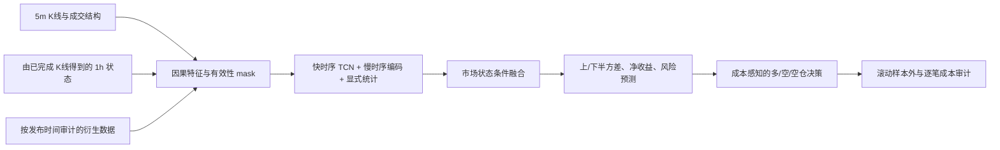

# Crypto Timing Network：研究设计阶段

本仓库记录从 BigAlpha 股票分钟模型迁移到 12 个加密货币永续合约的设计。当前阶段完成源码与数据核查、标签及网络架构方案；尚未实现训练、回测或宣称收益。

从 [迁移设计](docs/CRYPTO_TIMING_DESIGN.md) 阅读完整方案，从 [数据审计](docs/DATA_AUDIT.md) 核对实际字段和可用时点。

> 仓库 URL 沿用指定的 `netrual` 拼写；研究目标是合约**择时**，不是 12 币横截面中性排序。

## 源项目

源项目：`D:/Trading/bigquant`，核查基准提交 `85fd1de`（`feature/unified-alpha-fusion`）。迁移将复用其时间对齐、缺失掩码、多尺度因果卷积、统计分支、冻结输入合同与样本外审计方法；股票特有的盘口、行业、DeepSets 主干和日截面排序目标不直接移植。

数据本地位置：`D:/Trading/practical_crypto_strategy/data/parquet`。原始 Parquet 不进入本仓库。

## 当前状态

- 已读现有模型和 E8/E9 消融结论，核对 12 个合约的 Parquet schema、行数、范围、衍生字段覆盖率。
- 已给出主标签、辅助标签、网络模块、参数预算、择时映射、验证矩阵和开发顺序。
- 尚未生成特征仓、训练权重、样本外预测或回测结果。

