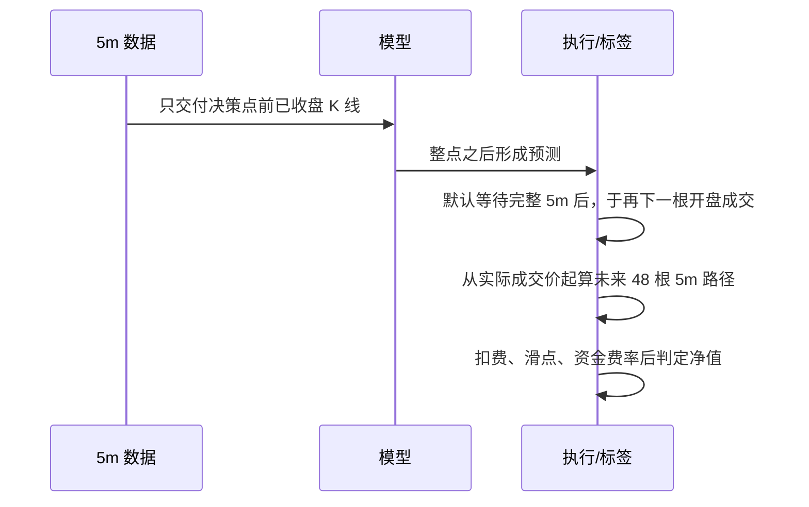
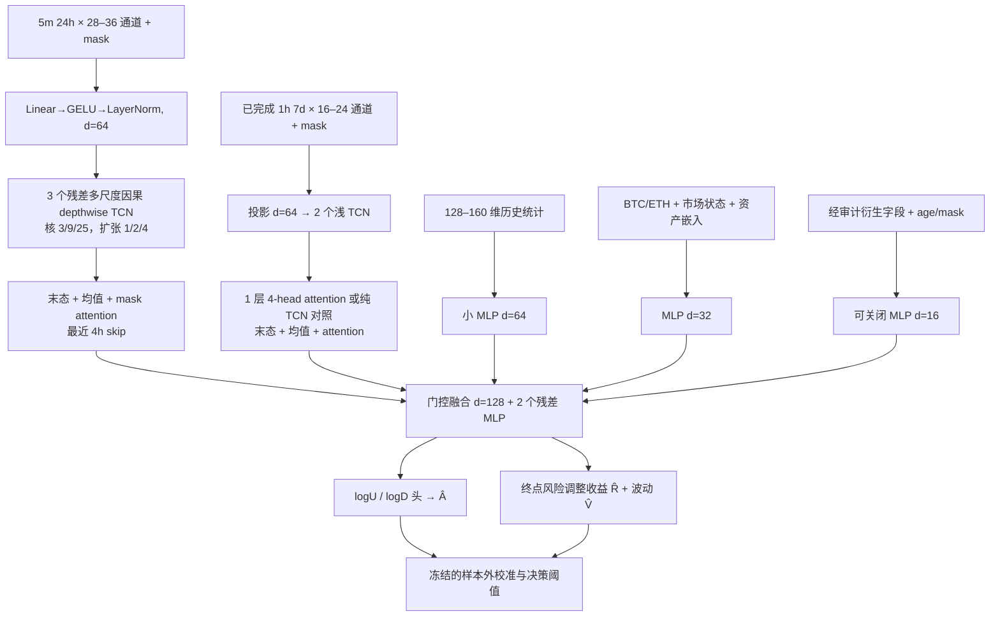

# 12 合约小截面、长时序择时网络：迁移设计稿

状态：**架构方案，尚未训练或回测**。2026-10-03 基于源仓 `D:/Trading/bigquant` 的 `85fd1de` 与本地 48 个 Parquet 文件审阅。数据实况见 [数据审计](DATA_AUDIT.md)。本稿中的窗口、维度和损失权重是待比较的**预注册候选**，不是已优化的超参数，更不是收益结论。

## 1. 问题重新定义

源模型对 `[日期, 股票, 240 个交易分钟, 17 通道]` 输出“次日股票横截面排序分数”；`DeepSets` 接入数百只股票的当日均值、离散度和相对偏离，优化每日 Pearson 加稳健回归。现在每个决策点只有 12 个高度共振的永续合约，市场 24/7 连续交易，目标是**同一合约随时间的多/空/空仓状态**。12 个合约提供共享学习和市场状态信息，却不能给出稳定的大截面排名梯度。

因此预测单位改成 `(UTC 决策时刻 t, 合约 s)`，输出未来路径的上/下实现半方差、终点收益和风险；先在样本外校准，再转为可执行仓位。市场截面只作为少量显式状态（BTC/ETH、广度、离散度、相对 beta 残差），不做每日 rank、不设行业中性化、不把 12 币等权多空分组当作主评价。

| 源项目构件 | 迁移处理与原因 |
|---|---|
| `microstructure.py` 的固定网格、`observed_mask`、因果多尺度深度卷积、`last/mean/attention`、统计分支 | 保留思想与数值稳定处理，重写 24/7 的 5m 网格及成交字段；股票午休和盘口 8 通道不再适用 |
| `temporal.py` 的 MaskedAttentionPool、因果 CNN | 可直接参考其实现及 mask 语义；慢分支按已完成小时聚合 |
| `DeepSetsContext` 和行业分组 | 不作为主干；12 币的均值/方差不稳且强同涨同跌。用低维共享市场状态，做 leave-one-out/固定主币对照消融 |
| 17 原始分钟通道 | 换为 5m OHLCV、成交笔数和主动买量构成的有经济含义因子；没有 1m/盘口，禁止伪造点差、真实订单簿失衡或 microprice |
| 下一日 O2C 排名标签、按日相关损失 | 改为未来路径半方差不对称为主，多任务学习终点风险调整收益；不再用日截面 Pearson |
| E9 架构对照 | 提示“更深/更多分支”并未稳定增益；三块是一个候选，不作为定论。E9 的 217,953 参数和四块劣势仅适用于股票任务 |
| E8 损失对照 | SmoothL1、L1、半平方 L2 未分出稳定胜者；本任务从稳健回归基线起步，独立消融损失，而非继承 0.05 系数 |
| frozen manifest、前缀不变性、训练期统计、隔离窗口、逐笔成本审计 | 保留为研究协议，按 5m 决策时钟重写 |

源实现入口：`src/alpha_models/microstructure.py` 的 `MicrostructureTCNBlock`、`_masked_channel_statistics`、`MicrostructureNetwork`，`src/alpha_models/temporal.py` 的 `MaskedAttentionPool`；归档扩展 `work/m_multiaxis/unified_m_multiaxis_model.py` 的多时间轴思想只借鉴“事件/时间路径”，现阶段不移植需要盘口原始字段的分支。源结果是迁移的工程证据，不是本市场上的 alpha 证据。

## 2. 交易时钟先于标签

推荐首版**每整点决策一次**，5m 为最细输入，主预测跨度 4h（48 个 5m 回报）；1h、12h 作为多任务或敏感性跨度。每小时决策大幅减少相邻样本重复，但相邻 4h 标签仍重叠，统计有效样本数远小于约 39 万个“合约×小时”键。每个折按 UTC 时间整体切，12 个币同进同出。



实现时必须冻结时间字段的定义：源 `date` 是 **开盘时间**；以 `close_time+1ms` 作为完整 K 线可见时间，并另加数据延迟缓冲。信号不得读取同一 5m 行尚未收盘的 high/low/close/volume。默认让信号经过一根完整的 5m 等待后、在再下一根开盘成交，含费用和滑点；同时报告再晚一根的压力场景。例如 00:55 开盘的 bar 在 01:00 完成，01:00 形成信号，基准于 01:05 开盘成交。若另测 01:00 立即成交，必须单列为乐观情景并证明可达性，不能仅靠相同时间戳假设零延迟成交。未来 4h 从实际模拟成交价而非信号时的 close 开始。

## 3. 标签：让“上/下波动率之比”可学习、可交易

令成交价为 `P0`，随后第 `j=1..H` 根 5m K 线收盘价为 `Pj`，`rj=log(Pj/P(j−1))`，其中第一项以成交价作分母；主跨度 `H=48`。定义路径上/下实现半方差：

```text
U = Σ[max(rj,0)]²,  D = Σ[min(rj,0)]²
σ²_past = 决策前 7 日 5m 收益平方的稳健滚动尺度
ε = max(10^-10, 0.01 × H × σ²_past)
L = log[(U+ε)/(D+ε)]
A = (U−D)/(U+D+2ε) = tanh(L/2) ∈ [−1,1]
Q = sqrt[(U+ε)/(D+ε)] − 1 = exp(L/2) − 1
```

`Q` 对应“上行波动率/下行波动率−1”；`L` 与 `A` 是它的单调稳定变换。模型主预测 `A`（或由 `log(U+ε), log(D+ε)` 导出 `A`），保留 `Q` 用于解释，避免一侧半方差接近 0 时比值爆炸。`ε` 只由过去尺度决定，不能用未来路径估计。`A≈0` 可能表示平衡震荡，也可能表示极小波动，因此同时预测总变动量。

辅助目标：`V = log[(U+D+2ε)/(H σ²_past+2ε)]`（未来实现方差相对已知基准）和 `R = clip(log(PH/P0)/(σ_past√H+δ), −5,5)`（终点风险调整收益）；另记录未截断收益与扣除实际成本、funding 后的净收益用于交易评价。`A` 描述**未来路径向上/向下的平方振幅差**，不等于 4h 终点方向或可实现 PnL；一段先大涨后跌的路径尤其能分离二者。交易层必须使用 `R`/净收益校准和成本阈值，不能规定 `A>0` 就无条件开多。

头部建议输出 `log(U+ε)`、`log(D+ε)`、`R`、`V` 或净收益概率；用两个半方差头的差经 `tanh(·/2)` 得到一致的 `Â`。首版损失可取 `0.45·Huber(Â,A)+0.20·平均Huber(logÛ,logU;logD̂,logD)+0.25·Huber(R̂,R)+0.10·Huber(V̂,V)`，各目标先按训练段尺度标准化，并按每资产等权聚合。系数只作为起点，通过固定样本外协议与单任务、无 `R`、无 `V` 比较。不要在同一未来路径同时把高度同质的 `A` 与 `L` 当作独立标签增加虚假的监督量。

标签边界：缺少未来任何必需 5m bar、OHLC 异常、成交价不可达或跨训练/验证边界的样本都隔离；收益的 `P0` 对应模拟可成交价。辅助任务不应以标注时刻的未知未来 funding 直接作为输入；funding 只在事后净 PnL 评价和经过证明的时间可用特征中出现。

## 4. 特征设计：因果、尺度不变、有机制

输入分成**逐 bar 快序列**（建议 28–36 个值通道加等长 mask）、**小时慢序列**（约 16–24 个值通道加 mask）、**显式汇总统计**（约 128–160 维）和**低维市场状态**（约 24–48 维）。不要盲目堆 454 个股票因子；这些候选是机制族，实作时需要冻结具体公式、窗口和单位。

| 机制族 | 具体候选（全部只用已完成 bar） | 作用 / 约束 |
|---|---|---|
| 价格路径 | 5m log return、实体、上下影线/区间、收盘位置、开盘跳差、VWAP 偏离；过去 1/4/24h 动量、反转、突破、回撤 | 表达冲击、趋势和回吐；价格用比值/对数，不输入 BTC 与 DOGE 的绝对价水平 |
| 波动和尾部 | 1/4/24h realized variance、历史上/下半方差及不对称、绝对收益、自相关、bipower 与 jump 代理、realized quarticity、波动的波动、日内最高/最低回撤 | 主标签的可预测状态；`bipower` 在 5m 上是跳跃代理而非逐笔跳跃判定 |
| 成交流向 | `2·taker_buy_quote_volume−quote_volume` 的有符号代理、买方占比及变化、滚动净主动额、成交额/笔数、每笔均额、量价同向持续性 | 5m 聚合主动成交可表达压力；它不是盘口 order-flow imbalance，也不能称真实 VPIN |
| 流动性与冲击 | `|r|/(quote_volume+ε)`、价格变化/有符号成交额的稳健冲击代理、成交额和笔数相对本合约同 UTC 时段历史季节基准的 surprise | 近似流动性、冲击与拥挤；对小额分母限幅并给 mask，不把 5m K 线推断成可成交点差 |
| 市场共同状态 | BTC/ETH 最近可见收益和 RV、12 币上涨广度/离散度、主币领先/滞后、合约相对 BTC 的滚动 beta 残差、滚动相关与共同波动 | 12 币截面在此只提供**状态**；当前合约可从市场均值中剔除，并做仅 BTC/ETH 与 leave-one-out 对照 |
| 24/7 时间结构 | UTC 小时、星期周期 sin/cos、周末标记、距资金费率结算的已知时长 | 加密市场没有 A 股午休和收盘；周期统计须以过去样本估计，不用全样本平均 |
| 衍生可用部分 | 已收盘 mark/index 基差及变化、已结算 funding 的水平/age/mask | 先仅作为可关闭分支；由于发布时间歧义，须通过 point-in-time 审计再启用 |

15m/1h 文件与 5m 源于同一市场路径，不能把三个频率当三份独立样本。首版从已完成 5m 因果聚合小时序列，取过去 7 日 168 个小时 token，补充 1/3/7 日波动、动量、流动性与周内状态。快序列看最近 24h 的 288 个 5m token；更久状态交给小时和统计分支，避免把 3 年连续 5m 原样送入网络。

归一化：比例和对数收益天然近尺度无关；成交量/成交额使用本币过去 30 日、同小时/星期的**历史**稳健基准，或训练折拟合的 median/MAD。每个折只在训练期拟合 clipping 分位数与统计量，验证/测试冻结。保留资产 ID 的小嵌入（约 8 维）与连续流动性尺度，允许共享规律与币种差异并存；做无 ID 消融。窗口内 z-score 可以作为附加通道，但不应单独使用，因为会抹去绝对风险/流动性状态。原值、有效性 mask、陈旧时间分开传入；不能靠零填充暗示观测到真实 0。

## 5. 建议网络：有深度，但容量按独立时间信息定



快支路 d=64 的三块 `3/9/25` 核、扩张 `1/2/4` 最大直接感受野为 `1+24·(1+2+4)=169` 个 5m 位置，约 14h；`mean/attention` 仍汇总 24h 全窗。最近 4h skip 保留最后阶段的冲击恢复。3 块并非必须：2 块、单核、无 recent skip 都列为消融。**因果卷积本身不够**：连续合约存在 4h 冲击、日内周期和多日波动状态，故增加小时慢轴、显式统计和低维市场状态。小时 attention 只作用 168 个 token；1 层而非大规模 5m Transformer，且必须与纯 TCN 在相同参数/预算下比较。

门控融合用可见的 `volatility, liquidity, missingness, age` 生成快/慢/统计分支的 softmax 权重，预设权重下限或熵正则并审计塌缩；首版同时有简单拼接 MLP 基线。门控只作**状态条件化**，不以未来标签或事后波动划分训练模式。稀疏衍生分支默认关闭；若启用，缺失时残差贡献精确为零并有 age 限制，避免模型用“数据后来才有”作为时间代理。

| 模块 | 建议设置 | 粗略参数预算 |
|---|---|---:|
| 5m 投影、3 个 depthwise TCN、序列汇总 | d=64、核 3/9/25、dropout 0.1 | 55–75k |
| 1h 投影、2 个浅 TCN、1 层注意力和汇总 | d=64、4 heads、FFN=128 | 55–70k |
| 统计与市场/衍生轻分支 | 统计 64、市场 32、衍生 16 | 14–30k |
| 门控与 2 个融合残差层 | d=128 | 90–130k |
| 资产嵌入和多任务输出头 | 8 维 ID、小头部 | 15–25k |
| **总计设计预算** | 源码实现后逐层精确计数 | **约 0.23–0.33M** |

参数量是计划预算，不是已构建模型的实测值；首轮建议锁在 0.2–0.4M。与源股票网络的 217,953 参数同量级，但信息结构不同。若 2 块、无注意力的 0.1–0.2M 版本样本外更稳，应选择简单版本。不要按 4,710,528 个 5m 行推断“样本极多”：价格强相关、标签重叠、12 币同暴露、真正独立的市场状态只有约 3.7 年，容量和不确定性都应按日期簇评估。

## 6. 从预测到策略：择时，而非代理标签套利

先在滚动验证期，以仅由过去 OOS 预测构成的序列拟合低维校准器，将 `(Â, R̂, V̂, 预测分歧, 成本, funding 预期)` 映射到未来**扣费后**多/空收益或概率；该校准器不得在其报告期内重拟合。首版线性/单调校准即可；复杂动态策略后置。决策可用：当 `E[net long] > risk_margin` 开多、`E[net short] > risk_margin` 开空，否则空仓；再按预测波动做有上限的风险定额，并给出每币仓位、全市场净/总敞口、同向相关组和最大换手上限。`A` 辅助确认路径质量，净收益期望决定交易符号。

评估同时报告纯预测和可交易账本：`A` 的跨时间相关/MAE/分位校准，`U/D` 的对数误差，未来实现波动校准，`R` 的方向与回归误差；策略报告每币与等风险合并的净 Sharpe、Sortino、最大回撤、成交笔数、持仓时间、换手、资金费用、分年/牛熊/高波动期表现。成本至少有 maker/taker 费率、可执行开盘滑点、不同名义交易额下冲击敏感性；费率与 funding 只按实际产品时点记账。给出零交易策略、固定风险持有、简单动量/反转/波动过滤等可比基线，避免“指标好但不可交易”。

## 7. 基线、消融和晋级规则

固定同一决策时刻、成交延迟、折、标签、成本和样本权重。先实现以下路线；模型有不同输入时分别标明可用字段，不能把多模态优势误写成深度优势。

| 层级 | 必要对照 | 要回答的问题 |
|---|---|---|
| 简单规则 | 不交易、固定风险长持有、1/4/24h 动量、短期反转、历史半方差阈值 | 标签是否转为超越简单规则的净收益 |
| 线性/树 | Ridge/Elastic Net、LightGBM；相同显式因子、同一 OOS | 神经网络对非线性/序列的增量 |
| 序列轻模型 | 统计 MLP、仅 5m 两块 TCN、仅 1h 编码器 | 真正需要哪条时间轴 |
| 主模型 | 5m + 1h + 统计 + 市场状态；衍生默认关 | 检验建议结构 |
| 定点消融 | 2/3 块、无 attention、无统计、无主动买量、无历史半方差、无市场状态、无资产 ID、无多任务、无门控 | 每项在相同折与种子是否有可靠边际贡献 |
| 稀疏数据挑战 | mark/index、funding、OI/链上（仅覆盖和发布时间合格时） | 辅助信息是否在**同一可用时间**提高 OOS，而非利用上线时间 |

按事先固定的**净效用主指标**（例如成本后、风险目标一致的组合日收益 Sharpe，并附收益/回撤和交易数下限）选方案；预测指标作为机理诊断。多个候选用日期块 bootstrap/配对差值、至少 3 seed、逐币逐折、最差折和成本压力报告。显著性不明时保留更小模型；不要反复从同一段历史选择特征、阈值和架构再称其“未见样本”。阈值只在训练内层或先前 OOS 校准期确定，下一段才报告。

## 8. 时间验证与泄漏审计

建议固定 2026-04-01 至 2026-09-24 为一次**封存最终历史评估段**；其前 2023-01-01 至 2026-03-31 做扩窗训练和至少季度级滚动验证，例如前 12–18 个月训练、下 3 个月验证，之后向前滚动。开发期 2026Q1 可作最后一次参数选择/校准；最终段只在架构、因子、损失、成本模型和阈值冻结后解封一次。由于研究者已能看到数据文件，严格说它是“封存协议的历史段”，不是现实中的全新未来数据；真正前向验证应另收新数据。

每个训练/验证边界按最大标签跨度 **12h 加成交延迟** purge；若用跨边界已成熟样本，必须有精确 `label_end <= training_cutoff` 证明。模型输入可读取验证前的历史 warm-up，但训练统计、clip 和校准只由训练段拟合。所有币的同一 UTC 区间统一剔除。训练按决策时刻的连续块抽样，按资产/月份平衡；验证按自然时间无抽样还原。重叠 4h 标签的置信区间按**日期或更长连续块**重采样，不能把 12×24 个点当独立样本。

强制审计：全量输入与任意过去截断输入在共同前缀的特征和预测一致；扰动未来 K 线、未来 funding、验证期统计和其他币未来值不得改变过去预测；任一衍生源报告 `first_known_time`、age、覆盖率和启用折；只用已成熟标签训练；预测记录含模型/特征/输入哈希、参数量、训练结束时刻、`decision_time`、`execution_time`。横截面同步信息仅当 12 币对应 5m bar 都已完整收盘才可读；缺币则 mask，不等待未来补齐。

## 9. 实施次序与完成门槛

1. **数据合同**：统一 UTC、5m 全合约键/缺口、OHLC、成交字段、小时重采样、衍生发布时间及源哈希。输出覆盖报告；未核实的 OI/链上维持关闭。
2. **标签与模拟成交**：冻结 bar 可见时刻、实际成交价、4h 半方差与辅助标签、12h purge；用合成路径测试 `A/Q`、起止时刻、延迟和费用。
3. **特征仓**：按机制族建立因果计算、mask/age、训练折归一化，跑全量/前缀与未来扰动检查；给出缺失、极值和按币分布。
4. **基线先行**：规则、Ridge/LightGBM、统计 MLP 和两块 TCN，同一 OOS/成本账本。
5. **主网络**：按本稿模块逐步接入，精确计数参数和显存；做多 seed、配对消融与门控稳定性报告。
6. **冻结选择并解封**：仅晋级在多数折、币与成本压力下稳定的模块；封存段评估后，之后只用真正新时期前向验证。

本轮已完成的是第 0 步的**源码与 Parquet 事实核查及方案设计**。上述 1–6 均为后续实施门槛，没有被本稿声称完成。
