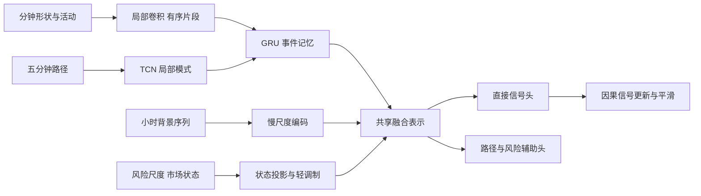

# 加密货币深度学习预测的标签 特征 表示学习与信号机制研究

**研究日期：2026-10-04。本文是新的分析与设计文档，不是模型实现报告。**

本文逐项回应[深度学习问题汇总](深度学习问题汇总-金融预测.md)，结合 [v3 完整研究报告](V3_RESEARCH_REPORT_2026-10-04.md)、[20 个问答](V3_MODEL_STRATEGY_QA.md)和[可视化报告](../reports/redesign_2026-10-04/index.html)，并重新阅读当前标签、特征、模型和训练源码。本文不把上一版方案作为必须维护的结论，也不把某次失败解释成神经网络路线应当停止。

**本次研究立场是：继续以神经网络为核心，围绕输入表示、标签信息、时序记忆和直接信号头重建研究闭环。收益与半方差两类监督应当并列研究；方向与幅度不宜未经比较就永久隔离；字段级预处理和特征冗余应提高到与网络结构同等优先级。**

与此同时，“一定要把网络做好”应理解为持续改进可学习的问题定义与模型能力，而不是要求一段历史必须给出正收益。当前结果约束的是已经实现的配置，并没有穷尽合理的深度学习设计空间。

本文重点是机制与推理。文中标注“代码事实”的内容来自静态核对；现有损失与表现引用原报告；新架构、参数和标签是研究建议，未经过本轮训练验证。本次只读检查了新增一分钟 Parquet 的元数据，没有重建缓存、改代码或启动训练。

## 一 先重新界定当前失败意味着什么

### 当前证据不能推出神经网络不适合这个任务

v3 的方向 BCE 在用于早停的 2025 年 7—10 月为 0.68818，状态 logistic 为 0.69190；到随后选择期，网络为 0.69202，logistic 为 0.68952。它说明网络在一个阶段找到了可用于降低方向损失的关系，后续阶段没有保留同样的优势。它没有告诉我们这种变化究竟来自输入尺度、市场状态、标签切分、表示压缩还是参数更新策略。

“训练下降、验证反弹”是症状，不是完整病因。把它直接概括为低信噪比或非平稳，会让研究停在任何金融模型都适用的解释上。更有价值的问题是：哪些输入在不同月份表达了不同含义；网络利用的是价格路径还是状态捷径；预测幅度是否随样本外尺度漂移而放大；未来幅度分档是否使同一个规律分散到了不同头中。

现有三个种子证明结果不是一个初始化偶然失效，但没有比较字段级预处理、记忆结构、共享方式和不同标签族。不能从“三个相近网络都失败”推出“这些方向已经充分研究”。同样，模块贡献没有测量过，就不应仅凭语义说慢分支、池化或幅度隔离已经发挥了预期作用。

### 上一版设计需要修正的三项判断

第一，我此前把“风险任务可能掩盖方向任务”直接转化成“方向与幅度完全分开训练”。这是便于诊断的方案，并非已经证明更适合学习的方案。负迁移应通过共享层梯度和表示增量来判断，不能只根据金融名称判断。

第二，我此前撤下半方差主监督的倾向过强。半方差不能直接等同于收益，但仍可能作为更容易学习的路径描述，为网络构造有价值的中间表示。正确处理是并列研究收益监督、路径监督以及两者的联合，而不是在一次失败后将某类标签永久排除。

第三，过去文档在“概率—收益—交易”上讲得多，在“原始数据—变换—表示—信号”上讲得少。对你当前的研究目标，后者更重要。一个目标再经济自洽，如果输入含义不稳定、有效顺序被压缩或信号输出缺少明确时间含义，模型仍然可能训练失败。

## 二 波动容易预测与方向难预测为什么可以同时成立

### 二阶矩信息强不等于带有更多方向信息

考虑收益的简化表示：

$$
r_{t+1}=\mu(X_t)+\sigma(X_t)\varepsilon_{t+1},
\qquad E[\varepsilon\mid X_t]=0.
$$

历史成交、价格区间和波动持续性可能帮助预测 $\sigma$，却未必帮助预测 $\mu$。若条件分布关于零对称、均值为零，无论波动多么可预测，上涨概率仍可能接近一半。这里不存在“网络浪费了本来就足够的方向信息”的必然结论：输入确实可能同时包含大量风险信息和很少方向信息。

但这也不意味着风险表示对方向无用。相同的买入压力，在低波动、流动性充足时可能形成持续冲击，在高波动、流动性恢复时可能迅速回吐。风险状态可以作为解释方向关系的条件。**风险信息更适合帮助模型判断何时采用什么方向规律，而不是独立替代方向监督。**

你担心改成收益标签会过滤掉很多特征，这个担心有一半成立。单一弱收益监督的梯度可能不足以教会网络认识成交、流动性与波动状态，辅助任务可改善表示学习。但并不是保留越多可预测特征越好：若某些特征只预测未来波动、完全不改善方向或信号可信度，强迫方向主干重建它们也会占用容量。

### 上下半方差都预测得好不代表比值也预测得好

设未来上、下半方差为 U、D。它们通常共享很强的总波动因素，可写成概念分解：

$$
\log(U+\epsilon)=v+a,\qquad
\log(D+\epsilon)=v-a.
$$

这里 v 表示共同风险水平，a 表示不对称性。如果网络主要预测到 v，两项单独误差都能显著改善，但两者之差中的方向信息仍然很弱。不能把“U 与 D 可预测”合并表述成“U/D 可预测”。旧报告中的 A/L 方向头在验证期没有稳定胜过常数，正说明这几个对象必须分开。

比值还涉及估计误差。若 $\hat U=U+e_U$、$\hat D=D+e_D$，一阶近似下：

$$
\delta\log(U/D)\approx e_U/U-e_D/D.
$$

两侧误差的相关结构、相对大小和分母都决定结果。预测两个大数后相减，不一定比直接预测其小差异更容易。因此保留半方差路线时，应明确直接学习不对称分量，并单独评价，不只报告 U、D 的拟合分数。

### 风险辅助监督的合理职责

建议赋予它三项明确职责：帮助底层学习活动强度、帮助方向头解释状态依赖、帮助信号头表达置信度与风险。它不需要先由人把“高波动”手工翻译成“做多”或“做空”。最终信号仍可以由网络直接输出，风险中间量可以只是训练时或解释时可见的辅助输出。

公开多任务研究已经提供梯度平衡与冲突处理方法，但没有可以直接引用为“行业统一标准”的神经交易架构。本文依靠可检查的学习机制提出方案，不用未经证实的行业惯例为某种结构背书。

## 三 端到端为什么仍会发生目标错位

### 连在一个计算图里不等于优化同一个问题

假设网络输出 $s=f_\theta(X)$，训练目标却是半方差 A 的平方误差。那么无限数据、容量充分时，最理想的输出接近 $E[A\mid X]$。即使输入到输出完全可微，它仍然没有被要求估计 $E[G\mid X]$。这首先是统计目标定义的问题，不需要出现代码错误或局部最优。

若再使用一个固定函数 $g$ 把 s 转成收益，通常：

$$
g(E[A\mid X])\ne E[g(A)\mid X].
$$

而且真实收益未必就是 A 的确定函数。未来 A 与未来收益高度相关，也不足以让它们的条件可预测分量相同。端到端无法自动纠正一个没有被损失函数要求纠正的目标。

还存在两类其他错位。其一是压缩错位：编码器丢掉后续信号需要的时序或幅度，后续再训练强大的头也无法恢复。其二是时间错位：训练输出表示未来 4h 的水平预测，使用时却把每分钟新输出都当成一个独立脉冲不断叠加。后者即使方向正确，也可能形成过大或过慢的信号。

因此，不应把一切归结为“局部最优必然导致全局次优”。有些是可修正的定义错误，有些是建模近似，有些是统计估计不足；并不存在金融预测必须通过彼此分离的模型才能完成的逻辑限制。

### 适合本项目的端到端定义

建议将主输出明确为：**给定当前可见信息，对预定未来收益核的有符号条件优势估计。** 可以是标准化预期收益、指定收益事件的概率差，或者经训练约束的连续 alpha score。信号含义固定，主损失直接约束这个输出。

网络内部可以包含卷积、GRU、风险头、市场状态调制和多个辅助任务；它仍是从输入到信号的端到端模型。中间存在多个模块不是问题，问题是最终主信号是否获得了直接监督，以及辅助任务是否帮助而非淹没这一监督。

信号不必直接等于持仓。主输出表达机会，持仓还取决于现有头寸与风险预算。将二者区分并不削弱深度学习的一体化：就像识别概率与具体控制动作可以分层，关键是接口具有一致、可验证的语义。

## 四 当前预处理到底做了什么

### 代码中的真实处理链

`redesign_cache.py` 先构造特征，其中已经有若干字段专属变换；`redesign_training.py` 随后调用旧训练器的 `_fit_per_symbol` 与 `_normalize`。对每币、每通道，以训练期中位数作为中心，以 IQR 除以 1.349 作为尺度：

$$
z_{i,t,k}=\operatorname{clip}\left(
\frac{x_{i,t,k}-\operatorname{median}_{train}(x_{i,k})}
{\max\{(Q_{75}-Q_{25})/1.349,10^{-5}\}},-8,8\right).
$$

非有限值填零，另附同维度有效性 mask。这是稳健缩放，不是传统均值方差 Z-score，也不是缩放到 0—1。

| 字段族 | 当前专属构造 | 随后处理 |
|---|---|---|
| 收益、实体、区间、影线 | 价格比的对数 | 全训练期、逐币稳健缩放 |
| 成交额、笔数 surprise | `log1p` 后减此前滚动对数均值 | 同上 |
| 主动成交压力 | $(2B-Q)/Q$，原本有界 | 仍执行同样稳健缩放 |
| 收盘位置 | 映射到约 −1 至 1 | 仍执行同样稳健缩放 |
| 流动性代理 | `log1p(1e6*abs(r)/(Q+1))` | 同上 |
| 当前状态中的波动 | 多窗口收益平方和开方，多数未取 log | 同上 |
| 幅度模块中的部分波动 | `log(rv+1e-8)` | 同上 |
| 小时、星期周期 | sin/cos | 同样参与逐币稳健缩放 |

所以“完全没有字段适配”不符合代码事实；“已经完成充分的适配性预处理”也不成立。现有做法只完成了第一层手工变换和统一数值整理，缺少对动态尺度、尾部压缩与经济零点的系统设计。

### 标准化不能消除重复特征

这是需要直接纠正的概念。对两个变量分别进行正的线性缩放和中心化，不改变其 Pearson 相关系数。标准化解决量纲与优化条件，去冗余解决重复信息，降噪解决估计误差，它们是不同工作。

非线性 log 或分位数变换可以改变线性相关，却不意味着创造了独立信息。例如成交额和其对数高度依赖，不能因为相关值下降就把它们当成两个全新的因子。LayerNorm 同样不是特征筛选器；它不会替研究者识别两项金融指标的经济重复。

### 两处可核对的实现细节

当前 `quote_surprise24h` 的实际表达式，是“当前小时成交额的 log1p 减此前 168 小时的平均 log1p”，并不是“过去 24h 总成交额的 surprise”。它不是前视，但名称会让研究者误解已有信息覆盖。因此在新增特征前，应先对照公式重建特征字典。

当前快通道缩放每隔 12 根 5m bar 取一次样本，固定取同一个小时相位。它降低计算量，却可能让整点附近的量能季节性影响尺度估计；网络实际读取所有相位。下一版应采用覆盖全部相位的分层抽样，或直接使用全训练期统计。是否已造成显著误差尚未测量，不能把它写成失败已证实原因。

## 五 字段级预处理应怎样设计

### 先决定保留什么信息再选择变换

每个特征至少写清五项：原始量纲、正负范围、经济零点、需要保留的绝对状态、缺失或陈旧的含义。随后才决定 log、缩放、截尾与动态标准化。不能将“所有列分布接近正态”作为目标，因为尾部、偏斜与波动变化本身可能是信号。

建议把输入分为**局部形状**与**背景状态**两条表达路径。局部形状去掉不必要的币价与风险尺度差异，背景状态保留被去掉的尺度、活动强度和流动性。这样不会要求同一个数既表示相对异常，又承担绝对风险含义。

### 收益和有符号变化

价格水平通常不直接跨币共享。使用对数收益、相对基准价偏离，或因果风险调整收益。对于一分钟收益，推荐形状表达为：

$$
z^r_{i,t}=\frac{r^{1m}_{i,t}}{\max(\hat\sigma^{1m}_{i,t-1},\sigma_{floor})}.
$$

分母优先只用此前已完成收益，让当前跳变能够表现为异常，而不是立刻抬高自己的分母。使用截至 t 的风险尺度在决策后也合法，但会减弱冲击的相对幅度；两者区别应明示。被除掉的 $\log\hat\sigma$ 和短长风险比作为状态保留。

不建议对每个收益窗口都减去本窗口平均收益后只保留残差，因为持续正漂移可能正是要识别的趋势。若使用窗口内去均值，应同时保留窗口均值、累积收益或斜率。对有正负号的厚尾指标，可用 $\operatorname{asinh}(x/a)$ 平滑压缩，近零近似线性、两端近似带符号对数，避免对负数错误使用普通 log。

### 成交额和成交笔数

成交量受价格水平与合约单位影响，跨币更适合使用成交额或相对活动量。`log1p(Q)` 可以压缩大数，但其中“1”带有隐含单位；美元与千美元计量在低值区并不完全等价。更明确的表达是 $\log(1+Q/q_0)$，其中参考尺度 $q_0$ 在训练或过去历史中定义。

活动异常可定义为 $\log(Q+\epsilon)-\log(\operatorname{EWMA}_{past}Q+\epsilon)$。它与当前“log 减 log 的均值”不完全相同，后者接近相对几何均值。两者各有意义，不能混称。若市场存在明显小时或周内量能季节性，应先用过去同类时段估计季节基准，再表达额外 surprise；样本少时向全时段基准收缩。

不要同时无约束加入成交量、成交额、对数成交额、所有近邻窗口均值与 surprise。可以保留一个长期流动性状态、一个短期相对异常和一个单笔金额指标，分别表达规模、变化和成交结构。

### 有界比例和周期字段

买方占比、压力比例、收盘位置和市场广度已有自然区间。推荐保留经济零点：压力零表示买卖平衡，广度可映射成 $2b-1$。默认不做逐币去中心化，否则某币“高于历史均值的卖方压力”可能数值为正，网络必须额外学习该偏移。

logit 变换在比例靠近 0 或 1 时会放大微小差异，只有端点可靠、确实有经济意义时才采用；少量成交造成的 0 或 1 不应被当成无限强信号。可以同时提供总成交额、有效成交笔数作为可靠度条件。

sin/cos 保留 −1 至 1 即可，二元 mask 保留 0/1。对已知有界变量继续使用逐币稳健缩放不是一定错误，但往往没有额外收益，也降低了跨币解释的一致性。

### 波动和流动性

波动优先采用 log 风险水平和短长尺度比，两者职责不同：前者描述整体风险，后者描述是否正在加速。不同窗口的 realized volatility 原值不能直接相除后都称“风险比”，先要统一时间尺度或清楚说明分母。

流动性代理的分母很小时容易爆炸。应按过去的合理下限处理分母、保留低成交或无成交标志，并通过平滑压缩限制数值影响。把所有大值硬截成同一个 8，会让正常高风险与数据异常失去区别。

### 方法选择表

| 方法 | 适合场景 | 主要代价或不适合之处 |
|---|---|---|
| 训练期 Z-score | 尺度相对稳定、尾部不极端的连续量 | 均值方差受异常值与阶段变化影响 |
| 中位数与 IQR | 厚尾字段的稳健静态整理 | 不解决未来尺度漂移，也不保证保留经济零点 |
| MinMax | 有确定物理边界的量 | 金融无界量不断突破历史极值；裁剪会丢失异常幅度 |
| log 与 log1p | 非负长尾规模量 | 不适用任意负值，参考单位与零值处理需明确 |
| asinh 或带符号 log | 有符号厚尾因子 | 需要指定参考尺度；仍会压缩真实尾部差异 |
| 滚动因果标准化 | 同币状态快速变化、局部形状建模 | 短窗估计有噪声；需保留被去掉的均值与尺度 |
| 分位数或排名变换 | 仅关注相对位置且尾部数值不可靠 | 丢失幅度距离，跨期映射会漂移，12 币截面尤其粗糙 |
| 实例归一化 | 需要局部平移或尺度不变性的序列 | 可能删除金融上有用的趋势、风险和活动量 |

RevIN 的原始方法通过归一化与逆变换处理序列分布变化，官方实现还强调输入输出特征维度与逆变换的对应关系。当前输入是多种经济字段、输出是信号，不能把原始价格预测的逆变换原样套到信号头；可以借鉴“形状与尺度分离并恢复”的原则。[RevIN 官方实现与论文说明](https://github.com/ts-kim/RevIN)

### 应比较的是三套预处理假设

推荐有针对性地比较：现有静态稳健缩放；字段专属变换加静态整理；字段专属变换加因果动态形状与背景双路。它们分别检验“字段分布是否处理不足”和“静态尺度是否造成阶段失配”。不要只排列十种 scaler 名称。

评价除预测损失外，还应看每币每月的中心和尺度变化、尾部截断率、低成交样本的异常率、首层激活、梯度以及信号对单位变换的敏感性。标准化的好坏最终体现为更稳定的经济表达与学习过程，不是直方图是否好看。

## 六 特征筛选为什么可能比加深网络更有效

### 冗余会改变有限样本下的学习偏好

你过去删除重复特征后改善明显，是值得重视的经验。即使理论上足够大的网络可以忽略冗余，有限样本和正则化下，复制输入仍可能改变模型的偏好。以线性权重的 L2 惩罚为例，同一信号复制成两列后，总权重可分摊到两项，使实现同一预测的惩罚变小。深度模型虽更复杂，但“重复特征没有任何影响”同样不成立。

冗余还可能来自多尺度重复：5m 序列已经包含全部收益，状态又提供 1h、4h、24h 收益，慢序列再次提供这些聚合。这里并非必须全部删除，显式统计可降低学习难度；应控制每项的职责，不要让同一趋势通过许多入口压过更弱的成交响应信息。

### 相关性筛选需要超过一张全样本热力图

先按机制分组，再在训练期检查线性、秩相关、滞后相关和分状态关系。全样本相关高可能只是共享牛熊趋势；全样本相关低也可能掩盖每个状态中高度重复的关系。对于流向与收益等交互特征，不能因线性相关低就断言独立，更不能因高度相关就自动删掉其中之一。

建议将特征分成四类：基础测量、状态、相对偏离、交互或残差。每个近复制簇保留定义最清楚、覆盖最稳定的一项；在有经济差异时保留“水平加变化”而非三个近邻水平。删前要考虑某个特征是否给网络提供了本来很难重建的运算。

例如 BTC 残差和原始收益看似重复，但有助于分离共同市场运动；它们可能值得同时保留。相反，`r4h` 与另一个定义几乎相同的 48 根累计收益没有独立职责，通常应合并。

### 模块贡献不能只用一次置零衡量

推理时置零某个通道，可能构造训练中没有见过的样本分布，造成虚假的“大贡献”。应结合重新训练的组级删除、保留结构但替换输入的控制，以及按时间块的条件扰动。单次特征重要性也不能代替跨月份稳定性。

值得关注的不只是“删除后分数涨了多少”，还有网络是否改变了依赖对象：原来主要依赖 BTC 与风险，删除重复后是否开始利用流向与吸收；增益是否来自尾部事件，还是只是把过度置信收回。这样才能把你的经验积累为可迁移的特征设计原则。

## 七 新增一分钟数据应怎样提供增量信息

### 已确认的文件事实和尚未确认的质量

本次在 `D:/Trading/practical_crypto_strategy/data/parquet` 下确认 12 个合约均有 `1m.parquet`，每个文件元数据记载 1,962,720 行。BTC 文件的时间元数据覆盖 2023-01-01 至 2026-09-24 23:59 UTC，包含 OHLC、成交量、成交额、笔数、主动买入量以及若干已派生字段。

这些事实说明一分钟信息确实可供研究，上一版“当前只有 5m”的描述不能继续照搬。但元数据相同不证明所有分钟连续、所有派生字段定义正确，也没有证明一分钟与五分钟数据完全一致。新增列中的 `vwap`、`log_return`、`taker_buy_ratio` 必须核对来源与定义，不能因为名字熟悉就直接作为可信输入。

### 真正增量来自五分钟内部的路径

五根一分钟 bar 汇总为一根五分钟 OHLCV 后，许多时间顺序已经丢失。先出现主动买入、随后价格上涨，与先上涨、随后追单，在总量与最终收益上可能相近，机制却不同。分钟数据的价值首先是识别这种先后关系，而不是把每小时标签复制六十次。

推荐三组分钟增量：压力与价格响应的先后；冲击的集中度与回吐速度；成交活动的连续性。可以构造过去 5/15/30 分钟压力变化、价格相对压力的滞后响应、最高成交分钟占比、收益符号连续性、上涨后回撤比例、成交额加权的路径偏离等。每项都应解释它为何无法被当前五分钟摘要完全替代。

但一分钟 OHLCV 仍不是逐笔订单流。不能从这些字段声称掌握了撤单、队列位置、隐藏流动性或真实买卖价差。价格响应只能叫聚合代理，成本也不能从一个分钟区间精确恢复。

### 三种融合方式的取舍

第一种是把分钟数据先聚合成新的 5m 路径特征，这是最容易定位增量的方式：模型时钟和主体保持不变，只增加五分钟内的不对称、集中与时序摘要。

第二种是独立的短分钟编码器，看最近 120—180 分钟，通过小卷积学习局部模式，再以有序的五分钟片段压缩。它保留原始分钟顺序，适合你希望强化网络自主学习的方向。推荐作为主架构的增强，而不是把过去三天全部展开成 4,320 个一分钟 token。

第三种是完整的多频率同步网络，让 1m、5m、1h 各自编码后交互。它表达力更强，但增加了对齐、重复信息与容量控制问题。应该先明确短分支已经提供增量，再加入更多跨频率交互。

共同原则是：按已完成 bar 对齐；小时 token 只代表当时完整小时；下采样前做合理聚合或局部滤波；各频率分开估计尺度。五分钟收益不是五根一分钟特征的任意取样，方差与流量聚合也不能都用平均代替。

### 一分钟监督频率与一分钟输入不是同一选择

可以用分钟输入、每小时生成主训练样本，继续预测 4h。只有发现机会衰减很快、需要更快响应时，再缩短决策间隔和调整标签。维持原来的 5m 入场延迟会过滤掉部分分钟级信号，这是研究合同的选择，不能一边保持长延迟，一边期待秒到分钟冲击的全部价值。

最好的短输入窗口长度取决于信号衰减，而不是“频率越高就应该看越长”。新增分钟分支先看 2—3h，长背景交给 5m 和 1h；这样容量用于不同职责，而不是重复存储同一市场路径。

## 八 四档标签究竟是什么以及有什么缺陷

### 它不是根据历史猜测未来标签

v3 先在训练样本结束后计算真实未来 4h 简单收益 G，再除以决策时已知尺度 v，得到 Y。之后把 $|Y|$ 放进固定的四个区间，并记录收益正负。历史只用于尺度下限、先验和收益代表值，实际标签来自已发生的未来结果。

例如 $v=1\%$、未来 $G=0.8\%$，则 Y 为 0.8，标签是第二幅度档的正侧；若未来为 −2.5%，就是第四档负侧。区间并不是同一小时 12 币排序，因此小截面不是这个标签的直接障碍。

它也不是通常意义的软标签。除精确零收益用 0.5 外，其幅度与方向都是硬类别。网络输出概率不等于训练标签已经软化。若使用相邻区间概率插值、或者依据标签噪声构造概率标签，那才是另一种明确的软化设计。

### 离散化的收益和代价

离散化降低了模型对每个极端数值的拟合压力，梯度尺度较容易控制，也可以突出方向与粗幅度。但它丢失区间内部信息，在边界附近制造突变。例如 Y 为 0.499 与 0.501 在经济上几乎相同，当前却更新不同档位的方向输出。

固定的标准化边界保持了公式一致，但不能保证经济含义绝对稳定。若过去波动尺度对当前市场风险估计变差，同一个 0.8 可能代表不同的真实异常程度。尺度下限还会使低波动时期不再完全按本地风险归一化。这些不是泄漏，而是尺度估计误差与目标漂移。

只占约 4.97% 的尾档，其实际有效市场事件比逐行样本数少得多。每个训练样本只监督四个方向输出之一，意味着按幅度分割了监督。共享主干减轻了这一问题，却没有消除跨档估计方差和尾档状态失衡。

### 数学上可分解不等于有限样本下值得分解

$$
P(S,J\mid X)=P(J\mid X)P(S\mid J,X)
$$

是恒等式，但不说明用两个不同输入、不同参数、不同选择时点的模型估计两项一定最好。乘法读出会同时承受两项误差；进一步乘以训练期档内幅度常数，又加入一层近似。

方向的条件分布还可能比无条件方向更难学习：某种状态下只有极少数样本进入尾档，这时 $P(S\mid J=4,X)$ 的估计可能非常不稳定。它不构成未来泄漏，但构成可识别性与数据覆盖问题。因此本次建议将四档分解保留为重要对照，取消其“默认最合理主标签”的地位。

另一个代码事实是，v3 的 `base(h)+offset(h)` 两项都是共享表示 h 上的线性层。其输出等价于四个线性 logit 加一种参数化与正则化，并没有新增特别的层次推理能力。当前偏移惩罚约束权重的平均平方，不直接约束每个样本的偏移输出，也不覆盖偏移 bias。不能仅凭结构命名就认定尾档已经得到充分的层次收缩。

### 当前方向选模指标与可用信号还有一层距离

v3 条件方向 BCE 在每条样本上用真实未来 J 选择方向头。这是合法的条件模型评价，不是泄漏；但实际预测时不知道 J，上涨概率应由 $\hat p_+(X)=\sum_j\hat q_j(X)\hat\pi_j(X)$ 得到。前者评价“各幅度子群中的方向估计”，后者评价“仅凭当前信息能否给出方向信号”。

即使前者改善，若幅度路由误差大，最终方向与收益信号仍可恶化。早停只看条件 BCE，会漏掉这一连接问题。因此四档模型应同时报告组合后的无条件方向概率评分与直接信号质量；若主目标是信号，最终权重选择不能永久停留在知道事后分组的条件指标上。

这也是不应仅凭 v3 的条件 BCE 判断标签已经对齐的原因。概率分解正确、训练没有泄漏、评估统计量有定义，这三件事都成立，仍不等于最终信号已被充分监督。

## 九 收益与半方差应并列为两条有明确职责的路线

### 路线 R 直接学习连续的有符号收益信号

保留从模拟成交价到 4h 到期价的 G，使用过去尺度标准化 $Y=G/v$，由网络主信号头直接输出 $\hat Y$。如果目标是条件均值，平方损失的统计含义最清楚：在适当矩条件下，其最优预测是 $E[Y\mid X]$。

金融尾部会使估计方差大，但解决办法不一定是把标签变成分类。可以使用可靠的尺度、样本质量控制、适度正则、参数共享与分组评价。梯度裁剪有助于数值稳定，但不能宣称它完全不影响优化；将收益裁剪、取 asinh 后回归也会改变目标，逆变换预测均值不等于原始收益均值。

因此路线 R 的主定义先清楚：连续风险调整收益预测；稳健位置回归、方向分类、分布预测作为有明确统计含义的变化，不混称“预测收益”。若最终输出只是 alpha score，可接受适度的稳健目标，但应通过样本外单调关系与直接收益锚定来明确其信号意义。

还要注意标签标准化隐含的样本权重。若令原尺度预测 $\hat G=v\hat Y$，那么 $(Y-\hat Y)^2=(G-\hat G)^2/v^2$。也就是说，标准化收益的平方损失相当于对原收益误差按逆风险平方加权。逐样本乘回 v 修复了输出量纲，却不会自动取消有限容量训练中这一取舍。它可能帮助跨币共享，也可能降低高风险行情在目标中的相对权重；需要明确我们究竟想估计等风险信号，还是更强调原始收益幅度。这个问题比单纯争论 MSE 与 Huber 更接近标签设计的核心。

为了降低单一终点噪声，可以研究未来末段平均价格对应的收益，或预设未来增量收益核：

$$
Y_t^K=\frac{1}{v_t}\sum_{j=1}^{H}K_jr_{e+j},
$$

其中 K 在训练前固定。均匀权重对应累计对数收益的一种缩放；衰减权重更强调近期价格响应。这是改变预测对象，不是免费给原始标签降噪。应同时保留固定 4h 可执行终点收益作为解释锚点。

### 路线 P 学习未来路径中的不对称压力

令路径收益为 $r_j$，定义：

$$
U=\sum_j\max(r_j,0)^2,\quad
D=\sum_j\min(r_j,0)^2,\quad
T=\frac{U+D}{v_t^2+\epsilon},\quad
Q=\frac{U-D}{v_t^2+\epsilon}.
$$

同时保留 $A=(U-D)/(U+D+2\epsilon)$ 或 L 作为有界或对数比版本。这里 Q 表示相对于过去风险的有符号平方压力，T 表示总活动；A 则进一步除去了未来总活动。它们不是完全一样的目标，应各自有清楚的假设。

Q 保留了“不对称强度”，A 更关注“在这段活动中偏向哪侧”。若一段极小波动路径与一段大冲击路径有同样比例，A 会接近相同，而 Q 能区分。反过来，Q 可能过度关注高风险尾部。并列比较的重点正是模型应该保留幅度还是消去幅度，而不是 A、L、Q 三个名字都跑一次就算研究充分。

不建议只训练 U 与 D 再相除作为唯一信号。可以使用共同风险 T 和不对称 Q/A 的参数化，使模型明确拥有不对称头。为了最终直接输出信号，增加一个由共享表示读取的收益信号头；路径监督作为主要表征来源，收益头负责将所学表示锚定到信号。

两条路线的区别是监督如何塑造表示，不要求最终信号永远是不同量纲。路线 R 以收益为中心，路径监督可选；路线 P 以路径表征为中心，直接信号头承担经济锚定。另保留纯路径模型作为对照，判断收益锚是否真有增量。

### 半方差不能机械地升级为越高频越好

这是新增一分钟数据后尤其值得注意的问题。在理想连续扩散模型中，采样越来越细时，上下 realized semivariance 的连续部分分别趋向总积分方差的一半；漂移对平方增量不对称的贡献会随高频细化减弱，跳跃则可保留不对称贡献。原始半方差研究关注下行风险，不能被解释成高频比例天然是更好的方向标签。[半方差原始研究](https://shephard.scholars.harvard.edu/publications/measuring-downside-risk-realised-semivariance)

现实中还有微观结构噪声。因此 1m 能更精细地描述风险路径，但未必让 U/D 的方向含义更强。可以用 1m 输入、继续以固定 5m 路径计算主半方差标签，再把 1m 标签作为频率敏感性研究。不要同时改变输入频率与标签采样频率后，把变化全部归因于更多数据。

一个简单路径例子也说明终点与半方差不同：对数收益为 +2%、−1%、−1% 时，累计对数收益为零，上半方差却大于下半方差。模型若学会识别这种冲击回吐，它可能很好地预测路径不对称，却不应因此输出持续做多信号。

### 标签比较应明确固定什么

收益族与路径族比较时，使用同一数据、特征、编码器和训练预算；分别看各自主任务增益、表示用于直接信号头后的增益与信号稳定性。不能拿不同量纲的训练损失数值直接比较。

初始只保留连续收益、路径不对称、路径辅助的收益信号、v3 四档分解四个角色明确的候选。之后才决定是否需要软分箱、累计有序分类或分位数预测。你的“标签本身比损失花样更重要”是合理重点：先确定未来对象和经济含义，再决定怎样评分。

## 十 方向与幅度应该怎样共享表示

### 三种共享方式需要分开研究

完全隔离适合判断每个任务的独立可预测性，也避免直接梯度竞争，但会失去共用路径知识。完全共享最节省表示，风险任务也可稳定底层训练，但可能让主干偏向容易的活动强度。**部分共享是本次优先建议：底层局部编码共享，上层方向记忆与风险聚合分开，最终由主信号头读取需要的状态。**

底层学习价格形态、成交压力与局部响应，可能对多个任务都有价值。上层收益任务需要有符号延续和反转，风险任务需要活动水平与尾部幅度，两者不必完全使用同一种读出。这样共享发生在信息确有共性的层次，而不是让所有头争同一个最终向量。

### 梯度问题要测量后再处理

在共享参数上记主信号梯度为 $g_s$、风险梯度为 $g_v$。应关注两者范数比、夹角及其随状态变化，而不是原始损失值大小。数值小的损失也可能产生大的共享层梯度。

可以用一个明确的辅助预算，例如初期把风险梯度的典型范数限制在主任务的一定比例内，再观察表示是否更稳定。0.2—0.5 可作为待验证的起点，不是行业常数。主任务接近零梯度时比例会不稳定，应有平滑与边界，不应机械逐 batch 强行对齐。

[GradNorm](https://proceedings.mlr.press/v80/chen18a.html)研究按训练动态平衡任务梯度，[PCGrad](https://arxiv.org/abs/2001.06782)研究冲突梯度的投影处理。它们提供机制工具，不证明应用后必有金融优势；单批次的负夹角也不自动意味着辅助任务应被删除。

### 预训练可以做但要保留迁移出口

使用风险、成交状态或局部路径任务预训练底层，随后加入直接信号监督，是合理方向。但风险预训练可能已经压缩掉方向信息，因此不应默认冻结整个编码器。可先冻结部分底层检查线性探针，再允许小学习率联合微调，观察收益信号是否获得额外信息。

这与“先预测风险，再手写规则生成信号”不同：风险任务主要塑造表示，最终信号仍由网络学习。若需要部署时完全简洁，辅助头甚至可以不作为对外接口，但其训练贡献必须能够被比较。

## 十一 当前时序网络还有哪些具体问题

### 输入覆盖不等于有效记忆

当前快序列看 12h，但末态直接感受野只有 41 根 5m bar；更早的信息主要通过均值池化进入。它能表达“过去出现过什么局部模式”，但对相隔较久事件的先后关系表达有限。例如先持续买入后出现价格背离，与先背离后恢复买入，局部模式计数相近，方向意义可能不同。

不能说均值池化删除了全部顺序，因为每个池化前 token 已包含局部顺序；准确说法是，它进一步压缩了这些局部事件之间的全局排列。是否保留事件先后，是加入记忆或有位置读出的合理理由。

### 慢卷积存在跨度与连续覆盖的区别

当前慢分支核宽 7，扩张率依次为 1 和 8。其末态的最大滞后跨度为 54 小时，通常称 55 小时感受野；但实际可达滞后为 $8a+b$，其中 a、b 都从 0 到 6。共有 49 个位置，中间缺少 7、15、23、31、39、47 小时等滞后。

这不是前视，也不意味着整个模型完全看不到这些小时，因为还有全窗均值与其他状态路径；但它说明“55 小时”不能被当成连续密集记忆。若研究事件间的完整顺序，应该选择覆盖更连续的扩张设计、加入循环记忆，或明确采用有序 patch，而不是只看最大感受野公式。

### 过早压缩和归一化值得检查

当前快分支三个 96 维摘要被投影回 96 维，慢分支两个 48 维摘要被压到 48 维，再加状态投影后融合为 96 维。这是一系列有意压缩，但还没有证据说明这些瓶颈保留了主任务需要的维度。

加宽可以改善瓶颈，但应先看表示有效秩、通道相关、分支梯度和简单探针。96 维并不天然太小，256 维也不天然更好。若模型输出几乎完全由状态分支决定，继续加宽快分支可能不起作用。

LayerNorm 在每个 token 的隐通道上归一化，可能减弱某些共同幅度变化。不能直接断言它删除了原始波动信息，因为网络还有偏置、非线性与状态输入；但应让原始风险水平有明确的旁路，不要求它仅以归一化隐向量的整体长度保存。

### 缺失掩码不是严格的缺失感知卷积

当前 `_masked_mean` 用该 token 超过四分之一通道有效作为是否进入均值的条件。mask 被拼进网络，但卷积仍会混合零填充与有效输入，末态读出也没有同样的汇总筛选。因此这是一种带缺失标志的近似处理，不等于所有时间操作都已按每通道缺失严格归一化。

现有数据缺失少，这未必是主要性能原因；新增一分钟数据后应更加明确缺失语义。无成交、缺记录、陈旧字段、预热不足应分开，不能都用一个零值表达。

## 十二 TCN GRU LSTM 和门控应怎样选择

### TCN 与循环记忆承担不同工作

TCN 适合并行识别局部形态、冲击和不同时间尺度的响应。GRU 通过门控制旧状态保留与新信息写入，适合表达事件持续和恢复；LSTM 多一个显式 cell 状态，在需要更独立的长期存储时有意义，但参数与优化复杂度也增加。

当前不应为了“真正的时序网络”而全面改成 LSTM；TCN 已经是时序模型。更有针对性的设计是 TCN 提取局部模式，再由单层 GRU 保留模式的发生顺序与持续状态。这样是在弥补现有读出的弱点，而不是更换模型名称。

优先研究快或中频路径上的单层 GRU，隐藏维度 64 或 96。不要一开始堆三层循环网络。若窗口内初始化为零，每个样本仍可独立批处理；若跨窗口持续传递隐藏状态，就必须维护严格时间顺序、重置规则和截断反传，不能继续任意打乱小时样本而假定状态正确。

### 三种门控不能混为一谈

GRU 的更新门控制时间记忆；分支 softmax 门控控制不同输入路径的相对权重；状态调制控制某些通道在当前背景下的响应。它们解决的问题不同。上一版去掉分支门控不能解释成金融任务不需要门控。

本次优先考虑低自由度的状态调制，例如：

$$
h'_t=[1+\gamma(c_t)]\odot h_t+\beta(c_t),
$$

其中 c 是已知市场状态，调制初始接近恒等映射。它允许同样的局部压力在不同背景下被不同解释，但不要求快、慢分支相互争夺一个和为一的权重。调制幅度需要约束，避免 c 变成记忆行情阶段的隐含时间标签。

### 池化应保留哪些信息

平均池化适合持续活动，最大池化适合极端事件却对异常敏感，末态适合近期状态，注意力适合选择重要片段但增加自适应自由度。没有一种必须独占。

推荐先用有明确时间结构的读出：最新状态、近 15/60 分钟摘要、有序的较早片段，以及 GRU 最终状态。若用注意力，加入片段年龄信息并检查权重是否稳定；注意力权重不能直接当成因果贡献。

输入通道混合与时间混合也应分开理解。pointwise 层学习同一时刻字段交互，时间卷积或 GRU 学习演变顺序。若两者都太弱，增加最终融合 MLP 并不能恢复已丢掉的信息。

## 十三 建议的神经网络主体与容量分配

### 主方案是多尺度编码与直接信号头

下列配置是为明确模块职责提出的起点，不是声称已经找到最优尺寸。应先实现不含分钟分支的可比较版本，再接入分钟增量，而不是把所有变化同时归因于新架构。

| 模块 | 推荐起点 | 解决的具体问题 |
|---|---|---|
| 分钟局部输入 | 180 根 1m，约 12—16 个精选字段 | 保留五分钟内部压力与价格响应顺序 |
| 分钟编码 | 宽度 48，两层小因果卷积，按已完成 5m 片段有序压缩 | 从噪声较强的细粒度数据提取局部事件 |
| 中频输入 | 144 根 5m，约 12—20 个精选字段 | 描述最近半日的冲击形成与恢复 |
| 中频编码 | 宽度 96 的浅 TCN，接单层隐藏 64 的 GRU | 在局部模式之外增加事件顺序和持续状态 |
| 慢背景输入 | 168 个小时，约 8—12 个字段 | 保留完整一周背景；与当前 72h 作有意义的窗口比较 |
| 慢编码 | 宽度 48 或 64 的浅连续覆盖 TCN，有序分段摘要 | 避免仅以一个均值表示多日演变 |
| 市场与当前状态 | 约 16—24 维，经 32 维投影 | 保存风险尺度、共同市场、流动性与周期 |
| 融合 | 直接拼接后到 128 维，一个残差块，可选低幅度状态调制 | 延后压缩并控制最终组合自由度 |
| 主信号头 | 直接输出连续有符号信号 | 为最终要用的对象提供直接监督 |
| 辅助头 | 总活动与不对称分量，或收益分布参数 | 改善表示、解释风险与信号质量 |

总参数宜先落在约 0.2—0.5M 的设计预算，实施后精确计数。容量增加主要来自有目的的分钟编码与记忆，不是无差别加深融合。8GB 显存约束下优先缩短高频窗口、做有序 patch，再调整 batch；不能为塞进长序列而过早把全部信息压成极窄向量。

图中的分钟片段与中频路径需要按时间对齐。可以先分别读出再融合；如果在同一 GRU 内组合，仅在最近三小时位置放置分钟编码，并提供覆盖标志，不能把缺少分钟编码的较早位置误解为零事件。更简单的第一版是分钟局部摘要作为中频记忆的额外条件输入。

### 不把市场同步性当成要删除的噪声

12 币共振既减少独立样本，也提供共同状态。市场分支应保留 BTC/ETH 收益、风险、广度与分散度；本币分支保留相对于市场的偏离。不要强制把所有收益做横截面中性化，否则可能主动删除主要择时来源。

可以将信号写成共同市场分量与本币条件残差分量，但这是表示分工，不是预设两个分量必须相互独立，也不是必须给输出做市场中性。不同币可通过连续 beta、流动性与波动特征共享规律。小资产 embedding 可以作为后续对照，而不是永久禁用；重点是限制其记忆历史平均收益与上市阶段。

### 为什么仍需要 MLP

当前 868 参数的小 MLP 是幅度状态分类器，输入已经是十个汇总风险变量；它不是用来处理整段原始时间序列，也不是拿它替代主 TCN。对这种固定长度状态向量，MLP 是自然的非线性函数近似器。

“MLP 一定弱于 LightGBM”并无普遍依据，表现取决于样本、结构、正则与特征。反过来，当前小 MLP 没有明显超过 logistic，也不能据此证明所有神经网络幅度建模都没有价值，它只检验了一个很小的状态模型。

MLP 若对时间维或有序 patch 做明确混合，也可以成为时序模型；公开的 TSMixer 研究就是例子。但普通状态 MLP 与这种时间混合结构不是一回事。[TSMixer 原始论文](https://arxiv.org/abs/2303.06053)

你的主张应落实为“主模型必须有适配时序的表示能力”，而不是“架构中不能出现 MLP”。输入投影、通道混合、融合和输出头都可包含 MLP，它们与时序模块分工合作。

## 十四 优化参数如何服务于这类弱信号

### 先核对实际学习过程再讨论训练轮数

v3 已经每轮覆盖全部小时相位，最佳轮次为 3—4。按其 12 轮余弦计划，首轮 warmup 后，第四轮结束学习率仍约为 $1.69\times10^{-4}$，尚未接近 $2\times10^{-5}$ 下限。因此它证明当前训练轨迹较早出现验证恶化，却没有充分检验“较低学习率下精修是否有增量”。

这不是建议直接采用更晚、验证更差的权重，而是说明训练长度与学习率日程需要共同定义。若某种结构只能在高学习率阶段被评价，早停结果不能替代所有低学习率训练策略的结论。

可保留 AdamW，以 $1\times10^{-4}$ 到 $3\times10^{-4}$ 作为有依据的局部学习率范围，重点比较固定优化步预算下的稳定下降与更早衰减。无需同时更换优化器、batch、标签和结构。新主干加入 GRU 后，应监控各层更新量相对于权重范数，而不仅看总梯度。

### 正则化不是越大越稳健

weight decay 的效果取决于学习率与更新次数。AdamW 每一步的直接衰减近似为乘以 $1-\eta\lambda$；写上 $10^{-3}$ 并不意味着参数每轮缩小千分之一，也不能只根据系数判断正则很强。

在弱信号任务中，过高的输入 dropout 会随机删除本就有限的线索；过低正则又可能记忆阶段。推荐局部时序 dropout 0.05 左右、融合 0.1 左右作为起点，优先使用组级约束、合理瓶颈和特征去冗余。若使用特征组 dropout，应确保不会经常删除整个经济机制，只把它作为缓解单一路径依赖的手段。

不建议任意翻转收益符号作为数据增强，真实市场正负尾部、资金费与流动性结构并不对称；也不建议随机打乱时间作为“增强”，它会破坏要学的机制。小幅、符合测量误差的扰动可以研究，但需要说明其不改变标签语义。

### 预热 早停 权重平均与初始化

主信号头从小输出开始通常合理，但全部输出层权重为零可能使主干首步没有梯度。小随机初始化、适当先验 bias 更合适。若是连续收益信号，初值应与训练目标中心一致；若是分档分类，各档先验应明确，不应把所有头初始化为一个与各档都不匹配的数。

早停应围绕主信号的时间外表现，不用风险总损失替代。可以同时保留少量后期权重平均作为固定候选，降低单一更新点的方差，但不能把多个 epoch 任意组合后反复挑最好。训练更长应换来更充分而可解释的优化，不能仅换来更低训练损失。

### 批次和标签重叠

跨币共享训练是合理的，但同一时刻 12 币不能贡献“12 份独立行情”的错觉。按时刻组织损失有助于避免缺币或币池变化导致某些时段被过度加权；批次尽量覆盖分散时点与状态。

相邻四小时标签重叠既增加训练冗余，也可能使某一次行情重复贡献很多梯度。可研究按事件覆盖程度调整训练权重，但若改变了采样分布，概率与均值目标的含义要同步说明。默认不能只挑大波动样本，然后还把输出解释为自然市场分布。

## 十五 信号必须成为明确的研究对象

### 先区分水平信号与脉冲信号

你提出信号脉冲叠加与平滑非常重要，但必须先分清输出含义。若网络每小时输出 $s_t=E[G_{t,t+4h}\mid X_t]$，这是对一个未来区间的最新预测水平。相邻预测覆盖同一段未来，不能把它们视为互相独立的新机会直接相加。

若模型输出的是新出现的买卖压力或预测修正，则它可以被视作脉冲。一个有衰减的状态模型可写成：

$$
a_t=\rho a_{t-1}+u_t.
$$

这里 u 是新增信息，a 是累积后的信号状态。若直接令 u 等于连续多个接近相同的水平预测，就会把相同证据反复累加。对常数输入 s，上式稳态为 $s/(1-\rho)$；这不是新增 alpha，而是人为放大。

对于水平预测，更自然的平滑是：

$$
\bar s_t=(1-\alpha)\bar s_{t-1}+\alpha s_t.
$$

它保持常数输入的尺度。若使用真正的脉冲输出，则应在标签或状态空间模型中定义“新信息”，例如对已有预测的修正，或某个事件对未来收益的增量作用，而不是仅把输出改名为 impulse。

### 信号平滑必须匹配预测时间尺度

EMA 通过低通滤波降低高频变化，同时引入滞后。如果有效机会只持续十分钟，平滑三十分钟可能将其抹掉；若机会持续数小时，适度平滑可降低噪声翻转。不能先假定“平滑越强越稳健”。

以采样间隔 $\Delta$、半衰期 $\tau$ 表达，$\alpha=1-2^{-\Delta/\tau}$。比任意写一个 0.9 更容易解释：它决定旧信号多久衰减一半。半衰期应结合信号对后续不同滞后收益的响应曲线与信号自相关研究，而不是按某个回测最高值反复挑选。

可以在网络内使用有约束的因果滤波层，使其参数与直接信号目标一起学习；也可以先用固定滤波器作为清晰接口。若加入信号差分惩罚 $\sum(s_t-s_{t-1})^2$，就需要训练相邻时间块，并且它会主动压制快速变化，不能用打乱样本的相邻行来计算。

所有平滑都只用过去。居中移动平均、双向滤波和使用未来序列的平滑标签或特征，若在预测端调用会前视；训练标签可以使用指定未来区间，但输入和在线信号处理不能借用这些未来值。

### 做多信号不等于固定的开多指令

正信号表示倾向增加净多头方向。当前持仓为空仓时可能开多，已有空仓头寸时可能减空或平空，已有多头时可能维持或加仓。这里“空仓状态”和“持有空头”必须明确区分。

因此主模型最好输出有符号信号水平或期望优势，动作层结合当前头寸解释。若坚持输出开多、平多、开空、平空四种动作，则当前持仓必须成为状态，并需要相应的序列决策训练目标。这是更复杂的研究问题，不能仅把四个分类头命名成四个动作就完成。

可以使用开仓阈值高、维持阈值低的滞回规则减少噪声翻转，但它属于信号使用机制，不能掩盖原始信号的预测能力。文档与评估应同时展示原始信号、平滑信号和动作，便于定位改善究竟来自哪里。

### 稳定有效预测也不能保证没有严重亏损

你的目标“有效预测不应总被短时跳变打败”合理，但不能进一步理解为稳定信号就应消除极端亏损。弱条件均值与大的随机波动可以并存，结构突变、共同风险与杠杆会放大损失。信号研究应减少不必要的抖动和过度置信，风险约束仍有独立职责。

这不意味着本次要把重点转回交易工程。恰恰相反，先把信号的方向、幅度、有效期、更新方式和可靠度定义清楚，才能判断网络是否真的学到了可用对象。

## 十六 标签时间跨度与训练时间区间怎样安排

### 四小时目标不是短期预测的唯一合理选择

收益预测不必越短越好，也不存在“低频择时需要短期预测，所以必然错位”的规律。预测跨度应该与信息持续性匹配：一分钟的压力可影响几分钟，也可能触发更长的连锁过程；三天背景可能调制四小时内的反转概率。

建议主目标继续保留 4h 以便比较，但明确研究一个短响应尺度与一个较长背景尺度，如 1h、4h、8h。不要首轮将三个头同权重混在一起；先比较同一表示能否对不同跨度提供稳定信息，再决定是否联合。

若确实联合，多头的职责应清楚：短头表达近期响应，主头表达持有期优势，长头表达持续性。不能把它们的原始分数简单平均，三个尺度的方差、成本意义和预测难度都不同。需要统一尺度或定义直接的联合信号目标。

### 当前训练期并不是三个月

v3 训练从 2023 年起到 2025 年 6 月末，扣除预热后约两年五个月；早停和校准为 2025 年 7—10 月，共四个月；规则选择为 2025 年 11 月到 2026 年 1 月，共三个月。你的疑问主要对应后两段，不是主训练只有三个月。

将三个月扩到四或五个月有助于减少评价偶然性，但月份数不是充分条件。若五个月只覆盖单一行情，仍可能不代表其他状态。更值得改的是在较长训练历史上组织多个向前验证时期，使网络结构、标签和预处理面对多次时间迁移。

推荐保留 24—30 个月以上历史作为主要训练起点，使用 4—5 个月的向前评价窗，并按预先规定的时间节奏滚动。较长历史有利于学习通用局部机制；对于状态发生变化的部分，可研究低学习率近期适配，而不是在“只用最近几个月”和“永远等权所有历史”之间二选一。

### 旧历史可以重新组织但不能重新命名为未见数据

2026 年 2—9 月可以按季度或状态重新分解，用于探索性机制分析，也可以在后续模型训练中按真实时间顺序使用。已有报告对此过于反复强调“不能用”，容易让人误解成这些数据从此失去研究价值；真正限制是不能用它们选出新方案后，再声称对同一历史完成独立确认。

若做回放式向前训练，每折都重新拟合标准化、标签尺度下限、特征筛选和网络，评价可以反映一个更新过程的历史表现，但研究者已看过行情这一事实仍须保留。真正的新到达数据用于最终前向确认，不妨碍此前积极研究和设计。

还应区分冻结模型长期不更新与按计划重训的系统。现有结果主要检验从 2025 年训练截止后一路冻结的模型；它不能完全代表定期更新的网络，但更新也不能只在看到失败月份后临时决定。

## 十七 基线怎样帮助把神经网络做好

### 基线不是要求放弃神经网络

你的目标是把神经网络作为核心研究对象，因此本文不以“线性更好就结束”作为研究终点。线性、树和小网络是测量工具：它们帮助判断现有信息是线性可读、需要非线性交互，还是需要真实的时序表示。

如果一个小模型只看当前状态就能接近序列网络，至少有两种解释：序列没有额外信息，或者当前网络没有有效提取序列信息。需要用结构对照区分，不能直接选一个解释。

### 更有诊断价值的对照体系

建议同时保留状态 logistic/Ridge、状态 MLP、使用同样精选状态的 LightGBM、去掉记忆的浅 TCN，以及完整 TCN 加 GRU。前几项测试状态信息与非线性，后两项测试顺序记忆。

还可以用网络表示加简单线性探针：如果表示中的收益信号可被线性读出，但原主头表现差，问题偏向训练目标或读出；如果加入 GRU 后探针增益才出现，则支持记忆改造有用。这比只比较最终净值更接近你的模型研究重点。

比较时要交代输入差异。一个使用精心筛选状态因子的树模型与一个只用原始序列的网络，差异可能来自特征工程；一个参数更多、训练预算更长的模型，也不能把全部增益归因于模块名称。

## 十八 需要怎样的消融才能回答你的问题

下表是一组有先后关系的研究问题，不是要求立即展开所有组合。先解决预处理和标签，再研究共享与记忆，最后研究分钟增量与信号处理。

| 研究问题 | 最少有意义的比较 | 主要观察对象 |
|---|---|---|
| 字段处理是否不足 | 静态稳健缩放 vs 字段适配 vs 形状与状态双路 | 分布稳定、激活、同目标预测与信号幅度 |
| 冗余是否伤害表示 | 原特征组 vs 机制去重组，辅以等数量随机删除 | 组级贡献、跨月增益、依赖对象变化 |
| 选错标签还是读出不足 | 连续收益 vs 路径监督 vs 路径辅助直接信号 | 自身目标与共同信号目标的分别增益 |
| 分档是否切碎监督 | 连续输出 vs 统一分布头 vs v3 分解 | 边界样本、尾档、校准与样本效率 |
| 风险帮助还是干扰主任务 | 完全隔离 vs 底层共享上层分开 vs 完全共享 | 共享层梯度与主信号时间外表现 |
| 记忆是否不足 | 相同局部编码加均值读出 vs 有序摘要 vs GRU | 顺序依赖、长滞后信息与信号衰减 |
| 宽度是否过早受限 | 保持层数和输入，局部宽度 64/96/128 | 有效秩、训练拟合与验证增量 |
| 一分钟是否有新增信息 | 五分钟主体 vs 分钟聚合增量 vs 短分钟编码器 | 路径信息增益，不以样本行数衡量 |
| 平滑是否改善使用效率 | 原始水平信号 vs 固定因果平滑 vs 受约束学习滤波 | 滞后、噪声翻转、同一尺度预测能力 |

每项都应优先解释机制，而不是只写“版本 A 的分数更高”。如果字段适配已经带来大部分改善，就不应把后续整体版本的收益都归因于 GRU；如果随机删除与机制删除同样改善，可能主要是容量或噪声问题，不能宣称识别出了唯一正确因子簇。

少量合理对照不可省略，因为独立推理能排除明显错位，却无法从数学上判定市场中的未知条件关系。你不希望靠无限实验碰运气，这应体现为每个比较都有可被推翻的机制假设，而不是取消必要的证据。

## 十九 对问题汇总的集中回应

| 你的核心问题 | 本文明确回答 |
|---|---|
| 是否必须先预测风险再手工变成信号 | 不必；风险可作为辅助监督与状态条件，最终直接训练信号头 |
| 收益标签是否过滤掉有价值信息 | 可能造成监督不足，但不是收益标签必然错误；路径辅助与部分共享值得研究 |
| 标准化现在有没有字段适配 | 有部分 log、比例与残差构造，随后统一稳健缩放；仍缺系统适配与比较 |
| 标准化能否解决相关重复 | 不能；需要独立的机制分组、冗余与噪声筛选 |
| 端到端为何会错位 | 计算图连通不保证统计目标、时间语义和读出一致；可设计修正，不是必然失败 |
| 四档是不是软标签或历史估计 | 大部分是由真实未来收益形成的硬标签，历史用于尺度和先验等拟合量 |
| 四档是不是应该继续作为唯一方案 | 不应；保留对照，优先并列连续收益与路径监督的直接信号方案 |
| 是否应同时研究半方差与收益 | 应当，而且要区分总风险、不对称、终点收益与它们的共享表示 |
| 是否加入 GRU 或 LSTM | 优先用浅 TCN 加单层 GRU补充事件记忆；LSTM 是明确对照，不是默认升级 |
| 是否应该恢复门控 | 区分记忆门、分支门与状态调制；优先低自由度状态调制与记忆门 |
| 特征筛选是否值得最高优先级 | 值得，与预处理同列首批研究；关注组级和跨状态冗余 |
| 小 MLP 是否不合适 | 对汇总状态适合，对完整序列没有天然顺序归纳偏置；它是局部模块而非主网络替代 |
| 方向幅度分开是否危险 | 不是数学错误，但会牺牲共享信息并增加分档误差；部分共享更值得优先检验 |
| 一分钟数据怎样加入 | 先研究五分钟内路径增量，再接短分钟编码器，不直接拉长所有窗口 |
| 信号如何叠加和平滑 | 先定义水平或新增脉冲；重叠未来预测不能无约束累加，平滑要匹配衰减速度 |
| 是否扩展三个月到四五个月 | 可扩展评价窗；主训练本已约两年半，更关键是多次向前迁移与预定更新 |
| 是否能继续用二月至九月历史研究 | 可以做探索和向前回放，不能重新当成从未参与设计的独立测试 |
| 是否因为未超过线性就放弃神经网络 | 不放弃；用对照定位信息、表示和优化问题，保持神经网络为研究主线 |

## 二十 本次最重要的研究判断

当前版本的失败不能仅归为“方向难预测”，更不能仅靠增加数据、训练轮数或网络深度解决。它同时存在几个值得优先研究的设计约束：输入尺度适配不充分，部分特征职责重复；未来幅度分档分散了方向监督；完全隔离的风险模块放弃了潜在共享表示；长输入经过局部卷积和均值压缩后，事件顺序保留有限；概率读出和最终信号之间存在多层近似。

这些不是本次已实验证明的全部病因，但它们都有明确的代码依据、统计含义或可检验机制，比笼统说“金融噪声太大”更能指导改造。

**我建议的主线是：字段级适配与特征去冗余，配合收益和路径两类监督并列；以局部编码加有限记忆形成共享表示，在上层区分信号与风险职责，让最终有符号信号获得直接监督。** 一分钟信息用于补足路径，而不是增加重复样本；宽度用于避免瓶颈，而不是堆总参数；信号平滑用于匹配信息有效期，而不是掩饰弱预测。

这条路线保留了你坚持神经网络的研究目标，同时把“做好网络”转化为一组具体能力：识别有效输入、保留有用顺序、学习状态依赖、控制任务干扰、输出时间含义明确的信号。最终需要证明的不是网络名字更复杂，而是这些能力确实逐项增加，并能在时间迁移后继续发挥作用。

## 资料与核对范围

本地阅读与核对包括用户问题汇总、三份报告、[v3 特征与标签](../src/crypto_timing/redesign_cache.py)、[v3 模型](../src/crypto_timing/redesign_model.py)、[v3 训练](../src/crypto_timing/redesign_training.py)及[基础标准化实现](../src/crypto_timing/training.py)。HTML 报告的正文和数值已读取，本次没有重新浏览器渲染其图形；图形中的结果没有被当成新的独立实验。

外部原始研究只用于核对方法性质，相关链接已放在对应讨论处：RevIN 的尺度移除与恢复、半方差的风险含义、多任务的梯度处理、MLP 的时间混合能力。没有把通用时序论文的结果当成本项目预测优势的证据，也没有声称这些文献代表所有量化机构的内部实践。

本次没有执行训练、调整交易规则、重算回测或修改源码。文中的新增一分钟信息仅来自文件与 Parquet 元数据读取；所有新标签、模块尺寸、共享方式、滤波和消融安排均为供下一研究窗口使用的设计建议。
