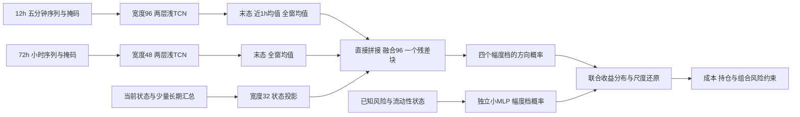

# 加密货币择时模型的预测目标与训练结构重设计

**日期：2026-10-04。性质：v3 核心研究设计。本文定稿时尚未实施；现已按方案实现和训练，具体结果见 [v3 视觉报告](../reports/redesign_2026-10-04/index.html) 与 [结果摘要](../reports/redesign_2026-10-04/README.md)。**

本文面向当前 12 个永续合约、5 分钟 K 线输入、4 小时择时任务。主要依据[失败诊断](TRAINING_FAILURE_DIAGNOSIS_2026-10-04.md)、[经验参考](TRAINING_FAILURE_reference_1.md)，并核对当前标签、网络、训练和交易校准代码。目标是提出一套有明确统计含义和经济用途的改造方案，而不是罗列待尝试模型。

**核心建议：保留 4 小时可执行收益这个经济任务，撤下半方差主标签；采用幅度与方向分离的收益分布模型，让方向编码器只接受方向监督；用更短、更明确的多尺度输入和浅而适度宽的网络，替代当前重复信息较多的门控融合。选模必须以方向增量为中心，不能再让波动预测替方向预测交出好成绩。**

这套设计首先解决“模型究竟在学什么、预测量是否能转成收益、容量应放在哪里”三个问题。它不会凭空增加数据中的 alpha，但能显著减少当前体系在统计目标、表示学习和决策映射上的错位，使成功与失败都有可解释的含义。

## 一 设计结论与优先级

| 设计项 | 本文主方案 | 选择理由 |
|---|---|---|
| 经济目标 | 成交后 4 小时的简单价格收益条件分布 | 与线性永续合约账本一致，不再通过路径半方差间接推导方向 |
| 标签 | 过去波动缩放的收益，按绝对幅度分 4 档，每档区分正负 | 同时保留方向和粗幅度，并能把波动学习与方向学习分开 |
| 主学习任务 | 给定当前信息，对各幅度档预测上涨概率 | 主编码器梯度明确来自方向，不能靠只预测大波动降低主损失 |
| 风险任务 | 独立小模型预测幅度档概率 | 风险模型服务于收益读出和仓位约束，不决定方向模型早停 |
| 快输入 | 最近 12 小时，144 根 5m bar | 保留冲击、吸收和数小时演变，减少整日高分辨率冗余 |
| 慢输入 | 最近 72 小时，72 个完整小时 token | 表达日内到多日背景；7 日、30 日状态用少量因果汇总补充 |
| 输出窗口 | 一个 4h 终点分布；首版不预测 48 个未来价格点 | 交易只需要该持有期的条件结果，逐点预测会稀释监督 |
| 主干 | 两个浅时序编码器、直接拼接、一个融合残差块 | 多尺度来自采样与感受野，不依赖分支竞争门控 |
| 默认宽度 | 快 96，慢 48，融合 96 | 把容量从融合层转向局部状态表示；参数预算约 0.08–0.15M |
| 训练单位 | 全部小时相位构成一轮，按时间簇组织样本 | 最佳权重必须见到完整时钟分布；跨币共振不能当独立监督 |
| 选模 | 方向条件交叉熵相对基线的跨月增益 | 不能按混合总损失或某个稀疏策略的最高 Sharpe 选权重 |

这些数值是有机制依据的首版设计取值，不是已测得的最优超参数。下一窗口应先实现这一条完整主线，不应把每一行展开成大规模网格搜索。

## 二 现有证据支持什么以及需要修正什么

### 训练失败主要发生在泛化与目标连接处

诊断报告中，训练损失持续降低、训练抽样的方向预测优于常数，而后续验证方向头没有稳定超过常数。波动头则明显改善。这支持“网络可以更新参数，却没有学到足够稳定的方向映射”，不支持把问题归结为权重不更新、数值下溢或普遍的 tanh 饱和。

但“没有打败常数”也不等于“没有信息”。例如报告中验证期预测 A 与真实 A 的相关约为 0.071，而误差略差于常数。这意味着预测的排序信息、偏置和幅度校准需要分别评价。相关平方约为 0.5%，说明当前单一分数的可解释方差很薄；它不是未来任何模型的预测上限。

冻结胜者零固定成本 Sharpe 仍为 −1.040，说明本轮失败不能主要由手续费解释。另一方面，报告给出的分数收益相关块重采样区间跨零，所以也不能把负相关点估计升级成已证明的永久“反向 alpha”。**应重新定义学习问题，不应把测试分数乘以负一当成改进。**

### 波动头胜过常数不是复杂时序结构有效的充分证据

当前波动标签近似为：

$$
V_t=\log RV_{t,t+4h}-\log(48\sigma_{t,7d}^{2}),
$$

忽略平滑项后，第二项在预测时已经可知。如果未来方差向长期水平回归，模型仅利用当前风险尺度，就可能明显击败“V 恒定”的基线。因此，现有结果证明系统能学到某种条件关系，却尚未证明 TCN 提取了不可替代的序列结构。

新方案的幅度模型应与过去波动持久性、长短波动比的小线性模型比较。只有超过这些基线，才把提升归因于复杂表示。这个修正会影响容量分配：无需为已可用简单规则解释的波动规律保留一个大型共享编码器。

### A 与 L 主要改变损失几何而非经济预测对象

代码中的两个标签满足精确恒等式：

$$
A=\frac{U-D}{U+D+2\epsilon}
=\tanh\left(\frac12\log\frac{U+\epsilon}{D+\epsilon}\right)
=\tanh(L/2).
$$

这个关系在原设计中也已写明。它意味着换用 L 能改变尾部权重、梯度和输出尺度，但不能给模型增加另一种未来信息。`evaluation.py` 对 `logratio4h` 输出取 tanh，也与其参数化相容，不能误判为转换错误。

更根本的问题是：终点收益对每一步收益线性累加，而半方差差异按平方加权。一次大冲击与许多小反向变动可以在两种目标中获得不同权重。模型即使预测到了路径不平衡中最容易预测的部分，也可能没有预测到持有终点收益。**A/L 可保留为风险解释量，退出首版方向训练，不再靠辅助权重保留其主导地位。**

### return4h 失败并未完整检验正确的条件均值任务

现有 `return4h` 同时包含四个选择：收盘终点标签、过去 7 日尺度归一化、截断到 ±5、SmoothL1，以及共享波动辅助头。其测试失败不能直接等同于“可执行收益本身不可预测”。

Huber 类损失的最优点一般满足：

$$
E[\psi_\delta(Y-a)\mid X]=0,
$$

而不是条件均值所满足的 $E[Y-a\mid X]=0$。只有特定分布条件下两者才相同。截断又进一步改变了所预测的统计量。Huber 对应专门的稳健位置泛函，这一点有[原始统计研究](https://arxiv.org/abs/2108.12426)支持。因此，稳健收益预测可以有用，但不能把其输出不加区分地称作“预期收益”。

此外，代码以无量纲的风险调整收益预测作为 `return4h` 校准输入，未显式提供当时的波动尺度。即使预测器准确估计 $E[G/v\mid X]$，还原也应是：

$$
E[G\mid X]=v(X)E[G/v(X)\mid X],
$$

因为 $v(X)$ 在决策时已知。一条跨全部波动状态拟合的线性校准线，通常不能替代逐样本乘回尺度。当前还用对数收益校准、简单收益结算；$E[e^r-1\mid X]$ 并不等于 $e^{E[r\mid X]}-1$。这些不是本轮失败已证实的唯一原因，却是新设计应直接消除的统计错位。

## 三 预测目标先服从持仓问题

本文继续研究单币随时间做多、做空或空仓，不把任务改成 12 币横截面排序。12 币高度共振，分十组每组约一只币，组标签对微小收益差异和成分变化非常敏感；而且相对最强不代表值得做多。

定义整点决策时刻 $t$，以已完成数据构成信息集 $\mathcal F_t$；模拟入场时刻 $e=t+5m$，到期 $e+4h$。毛收益定义为：

$$
G_{i,t}=\frac{P^{open}_{i,e+4h}}{P^{open}_{i,e}}-1.
$$

这是单位入场名义金额下的简单价格收益。沿用现有开盘价模拟合同，不代表实际订单必然能以该价成交。单边费用和滑点在交易层独立结算。

主预测对象为 $P(G_{i,t}\mid\mathcal F_t)$ 的粗粒度近似。实际决策再结合 funding 预期、持仓和风险约束。不要先给标签统一减去一个“双边成本”，再让多空共用它：做空的价格收益符号相反，资金费用也有方向，已有持仓的边际交易成本还不同。

首次从空仓开仓并在 4h 后强制平仓时，预期多头收益近似为 $\mu-\widehat F-2c$，空头为 $-\mu+\widehat F-2c$。但当前账本相邻同向持仓不重复收取开平费用，故一般情况必须使用 $c|w_t-w_{t-1}|$，而不是每段一律扣 $2c$。资金费率真实结算值用于未来实现账本；预测时只可使用已知信息形成的资金费用预期。

## 四 标签设计采用方向与幅度分离的条件分布

### 先建立因果尺度而非用未来波动归一化

令 $r_{i,u}^{5m}$ 为决策前已经完成的 5m 对数收益，$s^2_{24h}$、$s^2_{7d}$ 分别为过去 24h、7d 的均方收益。推荐初始尺度：

$$
v_{i,t}=\max\left\{v_{i,\min},
\sqrt{48\left(0.5s_{i,t,24h}^{2}+0.5s_{i,t,7d}^{2}\right)}\right\},
\qquad Y_{i,t}=G_{i,t}/v_{i,t}.
$$

短窗让尺度跟随近期风险，长窗减轻低波动和孤立冲击对尺度的扰动。0.5 是首版固定混合系数；$\sqrt{48}$ 只是量纲整理，不宣称收益独立、方差严格按时间线性增长。每币下限可取该训练折中上述原始尺度的第 5 百分位，并在该折后续冻结。

把 $v$、短长波动比和原始风险状态保留为输入，避免归一化擦除状态。不再用未来 realized volatility 作分母，也不先把所有真实大收益截成 ±5；数据异常剔除与真实行情尾部必须分开。

### 八个收益区间由四个幅度档和正负号组成

固定幅度边界为：

$$
|Y|\in[0,0.5),\ [0.5,1),\ [1,2),\ [2,\infty).
$$

记幅度档为 $J\in\{1,2,3,4\}$，方向为 $S=\mathbf1\{Y>0\}$。这给出四对正负区间，共八类。精确零收益可在方向 BCE 中用 0.5 的软标签，幅度仍归第一档；这是固定的边界约定，不代表有可交易的方向信息。

选择固定标准化边界而非每月滚动分位点，是为了保持经济含义：同一个类别始终代表相近的标准化幅度。八类也不是追求“比十类好”，而是以四种粗幅度支持方向条件化，避免当前小截面任务被过细档位割裂。

参考文档的十组 CE 值得吸收的是“用概率表达决策相关结果”，不应照搬其横截面分组。第一档也不命名为“不交易”：低幅度状态若成本低、持仓已存在，仍可能应当维持；高幅度状态若方向未知，仍可能应当空仓。

### 两个概率对象由不同参数学习

定义：

$$
q_j(X)=P(J=j\mid X),\qquad
\pi_j(X)=P(S=1\mid J=j,X).
$$

则联合分布为：

$$
p_{+,j}=q_j\pi_j,\qquad p_{-,j}=q_j(1-\pi_j).
$$

**幅度模块**是只读波动、流动性和少量状态变量的独立小 MLP；**方向模块**读取本次设计的序列与状态，输出四个 sigmoid 概率。方向模块可以看到已知波动，因为趋势和反转可能依赖风险状态，但幅度损失不得更新方向编码器，方向损失也不通过 q 反向改造风险模块。

每个样本训练时只选取实际幅度档对应的方向输出：

$$
\mathcal L_{mag}=-\log q_J,\qquad
\mathcal L_{dir}=-S\log\pi_J-(1-S)\log(1-\pi_J).
$$

两个损失之和正是八类联合分布的负对数似然，但参数与优化被分开管理。这不是再堆一个随意加权的辅助任务：**分解来自概率恒等式，隔离梯度则是针对已有失败证据的结构选择。**

概率恒等式不等于所选模型一定能准确表示真实分布。幅度模块只读状态子集，意味着主动放弃它对完整序列的部分依赖；如果简单状态模型遗漏了重要幅度信息，q 的误差会传导到收益读出。应先扩充它的少量风险输入，必要时给它独立的浅序列编码器，而不是重新让幅度损失主导方向主干。

训练使用未来幅度 J 选择监督项是合法的标签运算；J 绝不能作为方向网络输入。推理时网络同时输出四个 $\pi_j$，再由预测的 $q_j$ 加权，不存在预知未来幅度的要求。

四个方向输出共享主干。推荐用一个基础方向 logit 加四个小的档位偏移，偏移初始化为零，并施加轻微收缩，使尾部样本少时回到共同方向规律。不要独立训练四个大型网络。

### 为什么普通分类仍可能重演旧失败

普通八类或十类 CE 完全可能只学会“将来是大波动还是小波动”。即使正负两侧概率完全对称，CE 也会下降；这与旧模型靠 V 改善总损失具有同样结构。

本方案因此分别报告幅度似然、方向似然以及联合似然，并只用方向部分选择方向网络。方向指标相对训练期的各档常数概率、简洁线性方向模型比较，而不是只与 50% 比较。市场正漂移可能使常数上涨概率本来就不是 0.5。

交叉熵作为概率评分具有明确统计目标，但“概率评分改善”不等于“预期收益提高”。概率评分的理论依据见[Gneiting 与 Raftery 的原始研究](https://sites.stat.washington.edu/people/raftery/Research/PDF/Gneiting2007jasa.pdf)；本文的任务分解与交易映射是针对本项目提出的设计，不是该论文给出的金融策略结论。

## 五 从概率到预期收益必须承认区间内幅度

不能直接把八档赋予等间距整数分数并称为预期收益。理想的条件均值是：

$$
\mu(X)=v(X)\sum_{j=1}^{4}q_j(X)
\left[\pi_j(X)m_{+,j}(X)-(1-\pi_j(X))m_{-,j}(X)\right],
$$

其中 $m_{+,j}(X)=E[|Y|\mid S=1,J=j,X]$，负侧同理。该式精确；只预测 q 与 π 而没有区间内幅度，还不能完整识别条件均值。

首版采用透明近似：$m_{+,j}$、$m_{-,j}$ 用训练期相应类别的平均幅度，并向正负合并的档位均值收缩，稀疏尾档收缩更强。收缩规则仅由训练历史确定。这承认币种和状态间的区间内变化尚未完整建模，但优于把第 8 档固定当成“第 1 档的七倍”。不对开放尾档人为设定最大涨跌幅。

正负幅度代表值相等时，公式简化为 $v\sum q_jm_j(2\pi_j-1)$；不应为了输出对称而强制真实正负尾部具有同样幅度。对称的是分类边界和多空定义，不是金融收益分布。

尾档代表值是本方案最敏感的近似。若盈利主要依赖该档，必须检查预测净优势在尾部代表值的合理训练期估计区间内是否保持符号。若区间内幅度明显依赖当前状态，则升级为低容量的条件幅度模型或条件均值残差修正；不要靠任意加大尾档分数制造收益。

概率校准使用按时间产生的样本外预测，优先采用一个共享温度或向训练先验收缩，而不是每币、每档各拟合高自由度校准器。均值读出仍有系统偏差时，可以在**乘回 v 之后**校准，并显式保留原始预测与校准后预测的区别。

这一方案比直接 MSE 均值回归复杂一点，但其额外结构有明确用途：把难学的方向与容易的幅度拆开、限制极端标签对方向梯度的支配、保留可检查的尾部风险。直接对可执行标准化简单收益做 MSE 的小线性模型仍是必要的同目标对照；若它持续更好，应选择它，不应维护神经网络的形式优先级。

## 六 输入窗口与输出跨度按信息职责设计

### 主预测跨度继续采用四小时

现有数据尚未提供理由把 4h 改成 1h 或 12h 作为确定改进。短周期会提高成本占信号的比例；延长持有期能摊薄成本，却可能稀释主动成交与冲击状态的方向信息，并减少有效时间事件。

因此主方案保留 4h，只预测一个终点分布。1h 可作为后续研究信号衰减的诊断尺度，12h 可用于检验慢机制，但不在首版共享编码器中同时加入两个地平线。不同持有期可能要求相反方向，直接加权容易再次制造任务冲突。

每小时生成监督样本，是为了覆盖不同入场状态，不代表账户每小时独立叠加一个完整 4h 仓位。首版仍按四小时非重叠交易规则评估各起始相位；这些相位共享行情，不是四份独立证据。若以后改为小时调仓，必须先重写仓位账本与持有期含义。

### 快窗口从二十四小时改为十二小时

近期 5m 序列负责回答：冲击如何产生，主动成交是否持续，价格是跟随还是吸收，以及最近数小时是否发生反转。24h 原始高频序列包含不少可以由小时状态表达的重复信息。

推荐最近 12h 共 144 根 5m bar。这个窗口覆盖主持有期的三个长度，留出冲击前背景、形成阶段与恢复阶段。选择三个持有期不是普适定理，而是当前机制分工下的折中；不把参考文档中的“20 步”直接换成当前 20 根 5m。

两层因果 depthwise TCN，各使用核宽 9，扩张率 1 和 4，则末态的直接感受野为：

$$
1+(9-1)(1+4)=41\text{ 根 5m bar},
$$

即约 3 小时 25 分钟的 bar 覆盖。最近 1h 均值可汇总近期冲击，完整 12h 均值表示局部模式出现频率。整个 12h 的跨段信息通过这些摘要组合，不能把“池化见过 12h”误写成每个 token 已建模 12h 的任意交互。

### 慢窗口保留三天序列并增加少量长期状态

推荐最近 72 个完整小时，描述日内季节、三天趋势与波动转折；7d 和 30d 只提供当前汇总状态，例如波动、流动性基准、趋势及与 BTC 的关系。不再把 7d 高频派生统计反复铺进一个长慢序列。

慢编码器采用两层核宽 7、扩张率 1 和 8 的因果卷积，直接感受野为 55 个小时。最近末态与全窗均值共同读出。无需为了完整覆盖 72h 再增加一层；若未来证据指向更长路径交互，应明确增加该能力，而不是仅扩大输入张量。

新增 30d 历史状态会延长预热要求；不能沿用当前固定 168 小时的样本可用性规则。训练起点和缺失掩码应随实际最长因果计算窗口更新。

## 七 输入表达围绕机制重组

当前快输入、慢输入、80 维统计和市场分支多次表达 r1h、r4h、波动、流向及 BTC 状态。重复并不自动有害，但会让某些信息族获得更多参数路径，也使“删一个分支”的效果难以解释。新方案按职责去重复，而不是机械删除高相关特征。

| 输入位置 | 优先保留 | 不再反复铺入 |
|---|---|---|
| 5m 快序列，约 12–18 个值通道 | 单步收益、区间和收盘位置、成交 surprise、主动买卖压力、VWAP 偏离、BTC/ETH 同步与滞后变动 | 每个 5m token 重复 1h/4h/24h 各种滚动矩、小时星期周期 |
| 1h 慢序列，约 8–12 个值通道 | 正确聚合的小时收益、成交额加权流向、波动与流动性变化、市场共振 | 大量快序列的近复制末值 |
| 当前状态向量，约 16–24 维 | 1/4/24h 与 7d/30d 的少量状态、尺度 v、短长风险比、资产相对强弱、流动性、完整周期编码 | 当前 80 维统计的全量平移 |
| 幅度模块 | 波动、短长风险比、区间、流动性、少量市场风险状态 | 独立再学习完整高频价格路径 |

### 流向需要区分时间平均与金额加权

当前 `flow1h/flow4h` 是逐 bar 买方比例的算术平均。它回答“典型五分钟的买方占比”，并不等于该小时总成交的净买方占比。对于资金压力，优先使用：

$$
F_{t,h}=\frac{\sum_{u\in(t-h,t]}(2B_u-Q_u)}{\sum_{u\in(t-h,t]}Q_u},
$$

其中 B 是主动买入成交额，Q 是总成交额。否则极少成交的 bar 与大量成交的 bar 权重相同，可能掩盖经济上重要的压力。这不是未来数据问题，而是特征含义问题。

### 让模型识别压力被吸收还是形成趋势

比继续增加相近动量窗口更有价值的候选，是成交压力与价格响应之间的关系。例如，用过去训练或在线已成熟窗口估计简单冲击系数 $\hat\kappa_t$，构造 $r_{t,h}-\hat\kappa_tF_{t,h}$。买入压力很强但价格响应弱，可能意味着卖方吸收；压力和价格同步持续，可能意味着趋势延续。

这两种机制不预设为永远反转或永远追随。模型结合风险、流动性与近期路径决定其条件含义。估计系数只能使用过去，且 5m 主动成交代理不是订单簿不平衡，不能由它声称观察到了挂单深度。

### 分离市场运动与相对运动但保留绝对收益目标

当前已存在 beta 和 1h 残差，可以扩展为少数一致窗口的因果残差特征：$r_i-\hat\beta_{i,t}r_{BTC}$。同时保留 BTC 运动和原始收益，使网络能区分“跟随市场”与“自身超额压力”。

不建议立即把训练目标全改成 BTC 中性残差收益。这样会删除择时任务本来需要预测的市场方向，并隐含改变策略为对冲组合。只有用户明确要求市场中性策略，才把残差标签作为主任务。

归一化优先保留机制意义：价格变化除以已知风险尺度，成交额使用过去基准的相对 surprise；在此基础上用训练期稳健尺度限制异常值。波动和流动性原始状态单独保留。新增资产 ID 默认不用，先用连续 beta、风险和流动性描述差异，避免 12 个 ID 主要记住历史涨跌偏置。

## 八 模型结构减少竞争而保留表达能力

默认不使用分支 softmax 门控和 attention pooling。门控使分支表达先被竞争性缩放，而当前三分支信息相近，很难解释门控究竟选择了什么。直接拼接保留互补信息，由一个融合层学习组合，减少训练期偶然状态触发分支切换的自由度。

快分支从 64 加宽到 96，慢分支取 48，融合从 128 减到 96，融合残差块由两个减为一个。这吸收参考文档“宽度可能比深度重要”的经验，同时避免不加区分地把总参数翻倍。宽度用于容纳不同局部模式；深度与复杂融合先减少。

每个时序块采用 depthwise 时域卷积与 pointwise 通道混合，残差连接和 LayerNorm，激活 GELU。快读出三项分别表达现在、近期和背景；慢读出两项即可，不再把末态、均值、注意力和多段均值无限叠加。

约 0.08–0.15M 是设计预算而非实测参数量，具体取决于最终通道和投影。后续实现应逐层计数。减少参数不是因为 21 万必然过大，而是把复杂度从难以解释的融合模块转移到有用途的局部表示。

特征 mask 仍然是输入的一部分；窗口汇总应按有效 token 处理。现在把 mask 拼进模型，不等于当前普通均值和 attention 已自动排除了全部无效 token。低覆盖窗口应显式标记或剔除，不能让缺失填零通过卷积后成为看似真实的历史模式。

TCN 是合理候选，原始序列研究支持其作为通用序列建模起点，但不证明它能产生本任务的收益优势，见[原始 TCN 比较研究](https://arxiv.org/abs/1803.01271)。这里保留它是因为局部冲击与多尺度演变的归纳偏置合适，不是因为结构名称更先进。

## 九 训练参数围绕弱条件信号设计

| 项目 | 首版建议 | 推理依据 |
|---|---|---|
| 优化器 | AdamW | 保留现有稳定实现，不把优化器更换引入主问题 |
| 主网络峰值学习率 | 2e-4 | 与现有同量级，配合缓慢收敛而非长期恒定大步长 |
| 学习率计划 | 前 1 个完整覆盖轮 warmup，其后衰减到 2e-5 | 给先验附近的弱方向偏移更平缓的学习过程 |
| 训练上限 | 12 个完整覆盖轮 | 提供充分更新机会，不宣称更久一定更好 |
| 早停 | 至少 3 个完整覆盖轮后允许停止，patience 4 | 避免只见半个时钟相位就结束；始终保留此前最佳权重 |
| dropout | 时序 0.05，融合 0.10 | 保护短时弱模式，同时约束融合记忆 |
| weight decay | 1e-3，bias 与归一化参数不衰减 | 相比原设置加强参数约束，但不以高 dropout 破坏弱信号 |
| 梯度裁剪 | 全局范数 1.0 | 延续已有数值保护 |
| 批次组织 | 约 24 个分散时刻 × 12 币，约 288 行 | 批次增加时间状态覆盖，而非堆积相邻重叠标签 |
| 方向头初始化 | 接近训练期方向先验，档位偏移零初始化 | 从低信息预测开始学习小增量，抑制早期随机大幅方向置信度 |

方向头权重采用小随机值而非全部置零，保证主干从早期即可获得梯度。风险模块独立训练、独立保存；方向最佳权重不必与风险最佳权重在同一个 epoch。

每一完整覆盖轮都包含所有小时相位。相邻标签重叠不能通过“这一轮只见奇数小时”消失；这种抽样也不能让数据变独立。可以在批次内尽量拉开时刻，在一轮内遍历所有相位，并按整时刻平均跨币损失。模型训练可打乱训练段内批次顺序，验证则必须严格按时间分段。

不按类别频率的倒数对 CE 强行均衡。那会改变原始概率目标，使尾部过采样后的输出无法直接解释为市场概率。若为了优化稳定性抽样，必须恢复正确的重要性权重。首版按自然标签频率训练，只通过共享参数和收缩解决尾档稀疏。

对 sigmoid logit 而言，BCE 梯度为预测概率减真实标签，其幅度不随收益数值直接放大。这可以避免极端收益主导方向优化，也避免把小数值收益的梯度问题混入方向任务；但它不增加方向信息，近零收益的随机正负仍会产生噪声。因此不预设类别必须可分，也不追求训练准确率接近 100%。可泛化的弱信号本来就应该表现为接近先验、但在合适状态下略有偏移的概率。

首版使用历史训练样本的等时间权重，不默认加一个很短的指数半衰期。过强近期加权会在已有有效状态有限的问题上进一步丢掉历史。真正的适应来自固定频率的向前更新、因果状态归一化和显式状态条件化；遗忘速度只有在发现明确的历史失配后才成为下一项研究。

## 十 选模必须剥离方向增量与市场漂移

### 方向评价有两个难度不同的基线

第一层是训练期按幅度档估计的常数方向概率；第二层是使用相同当前状态的低容量 logistic 模型。神经网络至少应对第二层提供跨时间增量，否则没有理由支付时序结构的复杂度。

每个验证月计算：

$$
\Delta_m=\mathcal L_{dir,m}^{baseline}-\mathcal L_{dir,m}^{network}.
$$

用各月等权平均作为方向权重选择依据，同时呈现各月差值和去掉贡献最大月份后的结果。月度增益不需要每个月都为正，但不能只有一次行情产生全部结论。分幅度档报告，防止大量近零收益样本的微小准确率提升掩盖尾部方向恶化。

仅凭方向 CE 最优还不能选最终交易系统。需要同时看尺度还原后的预测收益是否校准、分数分组收益是否具有经济单调性、净优势是否覆盖成本。这样把“选神经网络权重”和“选择可交易系统”分为两个问题，避免每个 epoch 都用高噪声 Sharpe 选一次冠军。

### 池化相关需要拆开解释

把 12 币和全部时刻混在一起计算相关，可能混合三种来源：币种之间的平均收益差异、市场共同运动、每币随时间的条件变化。对择时有用的未必是前两者。

除了现有总体相关，还应报告每币时间序列相关、每时刻市场平均分数与市场收益的关系，以及去除同时刻截面均值后的相对关系。这是解释分解，不意味着三者都必须为正，也不要求把模型改成中性策略。若表现主要来自单一市场方向暴露，应按该风险暴露解释收益。

尤其不要把全局校准截距当成模型 alpha。原代码的 Ridge 校准含截距，若它吸收了某段市场平均收益，后续环境改变时会移动大量信号的开仓位置。新系统应分别展示“只用截距”“只用动态偏移”“完整预测”的贡献，并对截距作保守收缩。

## 十一 决策层用成本与持仓约束连接预测

主网络输出收益分布后，可以用以下简洁单币目标表达仓位选择：

$$
w_t^*=\arg\max_{w\in[-w_{max},w_{max}]}
\left\{w(\hat\mu_t-\widehat F_t)
-\frac{\lambda}{2}w^2\hat\sigma_t^2
-c_t|w-w_{t-1}|\right\}.
$$

它是下一持有段的均值风险成本近似，不是完整动态最优控制。若强制到期平仓，要另加退出成本；若连续持有，则按实际换手计费。多币组合还需要市场净敞口、总杠杆和共同风险限制，不能用各币方差独立缩放就认为完成了组合风险管理。

初次与旧策略比较时仍可用 −1、0、+1 等权仓位，先看预测改变是否有效；连续仓位与风险预算是后续决策改进，不能把仓位规则变化混成模型预测进步。

不以 $P(G>0)>0.5$ 直接开多，也不把 $P(G>成本)>0.5$ 当作唯一规则。胜率没有表达亏损幅度；收益尾部不对称时，较高胜率仍可能负期望。分布读出、区间内幅度和成本必须一起解释。

没有充分证据要求直接优化训练期 Sharpe 或端到端 PnL。对于当前弱方向、有限市场状态和近似成本账本，直接优化 PnL 容易把策略层误差也学进去。先把概率与均值读出做好，再固定预测器处理仓位，是更适合这批数据的任务分解。

## 十二 与参考经验的取舍

| 参考认识 | 本文吸收的部分 | 本文不直接沿用的部分 |
|---|---|---|
| 加宽有效 | 快表示加宽，让不同冲击模式有独立通道 | 不把所有层翻倍，不把照片的“唯一有效”当本项目事实 |
| 特征替换增益大 | 优先修正流向权重、量价响应、相对运动和重复职责 | 不用新因子数量代替信息增量 |
| 十分组 CE | 用条件概率替代含糊的代理分数 | 不在 12 币上照搬十组排名，不把 CE 改善直接当方向进步 |
| 对称读出 | 正负类别和交易符号统一 | 不强制收益幅度分布正负对称 |
| Huber 不一定有净收益 | 明确稳健位置与条件均值不同 | 不宣称 Huber 本身错误；它可服务风险与稳健预测任务 |
| 双头与双地平未必有效 | 首版只保留一个经济持有期 | 本文分开的 q 与 π 是概率因子分解，且不共享损失梯度 |
| ListNet 可能反转 | 排名必须匹配持仓与成本 | 当前择时任务没有必要用 ListNet 替换直接收益分布 |

参考文档关于“输入标签交叠需要隔离”的表述还应更精确：严格向前验证时，测试输入回看训练期已发生的价格是合法的，不必机械地额外隔离整个 72h 或 30d 输入长度。真正必须剔除的是截止时尚未成熟的训练标签，以及任何用后续数据拟合的尺度、选择器和校准器。置信区间要处理序列相关，但不能把合法历史重叠与前视泄漏混为一谈。

## 十三 用少量判别性证据检查推理

本文不建议靠更多试验搜索答案，但新设计仍需要少量能够判别机制的证据。其目的不是选冠军，而是决定下一步该改哪里。

| 观察结果 | 应作出的研究判断 | 后续动作 |
|---|---|---|
| 幅度预测改善，方向 CE 不优于线性模型 | 风险信息可学，方向增量仍不足 | 停止增加主干深度，研究输入机制或更换经济任务 |
| 方向 CE 改善，但收益读出没有单调性 | 概率改善集中在小幅度，或区间内幅度近似失真 | 查看各幅度档和尾部贡献，修正读出而非盲目换网络 |
| 毛收益有效，净收益不足 | 预测信息存在但不足以覆盖当前执行频率 | 处理持有连续性、换手与容量；不能改称模型无信息 |
| 小线性模型同样有效，神经网络无增量 | 输入改造有效，复杂结构无必要 | 采用小模型，并保留已有效的标签与时间合同 |
| 只在一个月份或一个市场方向有效 | 学到了阶段性暴露或过度条件化 | 缩减状态自由度，分析暴露来源，不用挑窗口掩盖问题 |

最小研究闭环只需要：同目标线性基线、本文主模型、方向与幅度分项评价，以及固定交易映射。无需首轮同时加入 Transformer、多个 horizon、资产 embedding、对比学习和几十种损失。

已经解封的 2026-02 至 2026-09 历史不能再次称作新方案的未见测试。可以把它用于清楚标注的探索性诊断或后续训练，但确认性前向证据必须来自本设计锁定后、未用于设计选择的新数据。仅因日期晚于 2026-09-24 并不自动独立，还要确认研究过程中没有查看和选择。

时间滚动验证中，每折的标签尺度下限、特征标准化、方向先验、幅度代表值和校准都重新只用该折过去数据拟合。误差和收益的不确定性按连续日期块并保留整币面板评价；四交易相位不能乘算为四份独立样本量。

## 十四 给后续执行窗口的设计边界

本方案的必改部分是：统一可执行简单收益标签；取消 A/L/V 对主方向编码器的混合监督；隔离幅度与方向梯度；显式乘回因果尺度；完整覆盖小时相位；按方向增量选择权重。它们直接针对已经识别的逻辑错位。

12h 与 72h 输入、96/48/96 宽度、学习率与正则化数值属于推荐默认配置，可以在实施约束下小幅调整，但调整应保持各模块职责。首版不增加横截面排序、更多地平线、大型注意力或直接 Sharpe 优化。

旧版缓存与结果应保留。新标签、特征与模型需要独立版本，因为它们已经改变经济目标和张量含义；不能复用旧的 `best.pt` 或旧校准器并沿用原名称。相应修改集中在 `cache.py` 的标签和特征、`training.py` 的样本组织与分项选择、`model.py` 的方向结构、`evaluation.py` 的收益读出与账本连接。本次仅给出职责，不规定代码逐行实现。

最有价值的成功标准不是“训练更多轮后损失更低”，而是：**方向模块在向前时期提供超过简单条件基线的增量，这个增量能在正确尺度上转成收益，并在同一成本与持仓合同下保持经济意义。** 若三者只有第一项或第二项成立，研究应能准确指出断点，而不是继续用总损失掩盖问题。

## 十五 证据与来源

本次完整阅读两份用户指定文档，并核对以下本地实现与原报告；现有绩效和损失数字引用既有报告，没有重新训练或重新测算模型绩效。

- [训练失败诊断](TRAINING_FAILURE_DIAGNOSIS_2026-10-04.md)：分头损失、早停、训练验证差异与失败证据。
- [用户经验参考](TRAINING_FAILURE_reference_1.md)：宽度、特征筛选、分类读出和损失迁移的经验背景。
- [冻结结果报告](../reports/2026-10-03/README.md)：时间切分、测试表现和统计边界。
- [原始设计](CRYPTO_TIMING_DESIGN.md)：原任务定位和标签关系；其早期规划不能覆盖实际运行报告中的时间切分。
- [标签与特征实现](../src/crypto_timing/cache.py)：A/L 恒等关系、收益终点、流向聚合、当前统计重复和 beta 特征。
- [训练实现](../src/crypto_timing/training.py)：288/168 输入窗口、损失、小时相位与停止规则。
- [模型实现](../src/crypto_timing/model.py)：门控、TCN、读出、融合与输出头。
- [校准与交易实现](../src/crypto_timing/evaluation.py)：校准输入、截距、简单收益账本和换手成本。

外部原始资料仅用于核对方法性质，已在相应论点处链接：Huber 所估计的统计泛函、概率评分规则、TCN 的通用序列建模依据。本文提出的标签分解、窗口配置、参数和模型结构是面向本项目的研究设计，并非外部论文或现有训练结果已经验证的收益结论。
