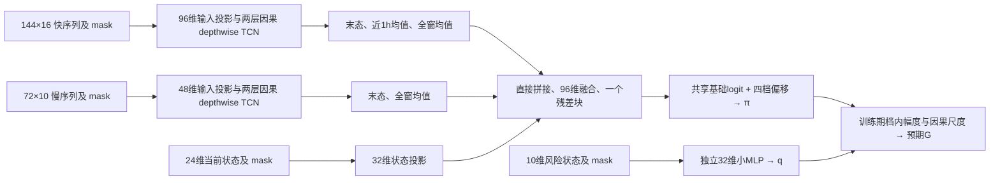
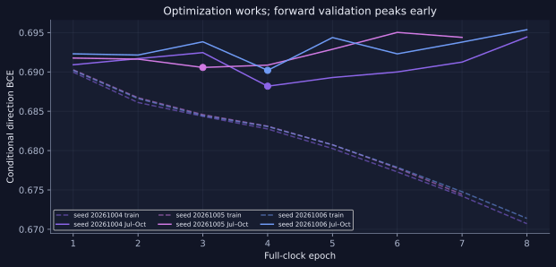
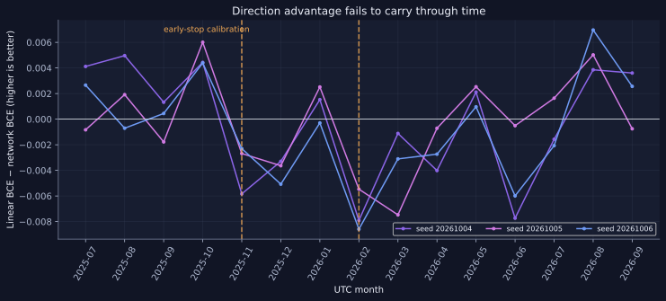
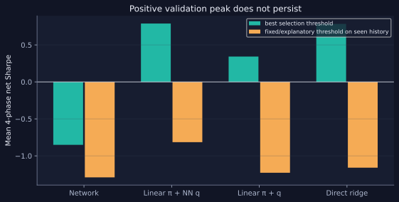

# 加密货币合约择时模型 v3：完整研究与实现报告

**版本：** 2026-10-04 实现与评估快照。

**对象：** 12 个永续合约，5 分钟 K 线输入，整点决策，4 小时持有期。

**研究结论：** 当前版本完成了目标、特征、网络、训练、基线与成本账本的闭环，但尚未获得稳定超过简单模型的方向预测与净交易优势，**暂不部署**。

本文面向熟悉基础深度学习与金融研究方法、但不熟悉本仓库的读者。先解释策略究竟预测什么，再说明信息如何进入模型、模型如何训练和选择、结果支持到什么程度。图形和逐月明细见[可视化报告](../reports/redesign_2026-10-04/index.html)；设计推理见[重设计原文](TRAINING_REDESIGN_2026-10-04.md)。

## 1. 研究任务和前一版的问题

本项目从本机 `D:/Trading/bigquant` 的 BigQuant 股票分钟模型出发，复用其时间对齐、缺失掩码、多尺度序列编码和可复现训练框架，转向加密货币永续合约。两类任务的统计结构不同：本项目只有 12 个高度相关的合约，主要利用每个合约随时间变化的状态做多、做空或空仓；它不是在上千只股票之间做当期横截面排序。真实独立信息量更接近经历过的市场状态数，而不是“小时数 × 12”这个表面样本数。

前一版以未来路径的上、下半方差不平衡及波动率为重要训练目标。模型可以学习到风险状态，训练损失也能够下降，但方向输出未能稳定转换成扣成本后的 4 小时持仓收益。[训练失效诊断](TRAINING_FAILURE_DIAGNOSIS_2026-10-04.md)已经指出：这不是“神经网络权重没有更新”的直接证据；更值得先处理的是**监督目标、收益读出和择时决策之间的错位**。旧版实验和结果保留在[历史报告](../reports/2026-10-03/README.md)，v3 另建缓存和检查点，不覆盖它们。

v3 的核心研究问题可以写成连续三关：

1. 在决策时可见的信息中，能否预测未来 4 小时的**条件方向**，并超过简单条件模型？
2. 方向与幅度概率能否以正确的尺度组合成可解释的**预期简单收益**？
3. 该收益优势在既定持仓、手续费、滑点和资金费合同下，能否成为**稳定净收益**？

只有第一关成功不能证明第三关成功。本次结果恰好展示了这种分离。

## 2. 数据、决策时钟和可用信息

原始主数据位于本机 `D:/Trading/practical_crypto_strategy/data/parquet`，由 12 个合约的 5 分钟 OHLCV、成交额、成交笔数和主动买入成交额组成。当前每币 392,544 根 5 分钟 bar，对应 32,712 个完整小时，决策时钟从 2023-01-01 延续至 2026-09-25 UTC。`date` 是 5 分钟 bar 的**开盘时刻**；缓存构建会检查相邻时间间隔、开盘与收盘时间字段、12 币时间网格一致性。资金费数据在交易账本中按事件区间结算；本版主网络没有把未来实际资金费当作输入。

对每个完整小时，先等最后一根 5 分钟 bar 结束，再形成决策。设整点为 $t$，模拟入场为 $e=t+5\text{m}$，到期为 $e+4\text{h}$：

$$
G_{i,t}=\frac{P^{\mathrm{open}}_{i,e+4h}}{P^{\mathrm{open}}_{i,e}}-1.
$$

$G$ 是单位名义资金的**简单价格收益**。采用开盘价是清晰的离线执行合同，并不保证实盘订单可按该价格成交。单边 6bp 的费用加滑点是假设情景，另在账本中扣除。

### 时间分区

| 用途 | 时间 | 有效合约×小时标签 | 可以做什么 |
|---|---|---:|---|
| 训练 | 2023 年起至 2025-06-30 | 253,944 | 拟合尺度、标准化、先验、基线及网络参数 |
| 逐轮校准/早停 | 2025-07-01 至 2025-10-31 | 35,376 | 选择最佳方向 epoch 与幅度 epoch；拟合低维概率收缩诊断 |
| 规则选择 | 2025-11-01 至 2026-01-31 | 26,448 | 比较冻结预测器及少量预定交易阈值 |
| 已查看历史 | 2026-02-01 至原始数据末端，约 2026-09-24 | 67,920 | 仅做探索性诊断，不声称独立测试 |

训练、校准与规则选择期的标签都要求在该段截止前成熟：决策后还有 5 分钟入场延迟和 4 小时收益窗口，故边界前未成熟的标签被剔除。模型输入回看边界以前已发生的价格是合法的；需要防止的是用尚未成熟的标签、后期数据拟合的预处理量或后期选模结果回流到过去。720 个完整小时用于 30 日状态预热。

**重要证据边界：** 2026 年 2–9 月曾在旧策略研究中被查看。本次虽对 v3 权重和规则实行冻结读取，研究者仍已知道这一段的一部分市场结果。它不能重获“未见测试集”身份。最终确认必须来自设计锁定后真正未参与任何选择的新时期，或者预先规定、多折重拟合的向前实验。

## 3. 标签：将可执行收益拆成方向与幅度

### 3.1 决策时已知的波动尺度

直接用 $G$ 训练时，币种与市场阶段之间的波动尺度差异很大。v3 用过去 24 小时和 7 日的 5 分钟对数收益均方形成尺度：

$$
v_{i,t}=\max\left[v_{i,\min},
\sqrt{48\left(0.5s^2_{i,t,24h}+0.5s^2_{i,t,7d}\right)}\right],
\qquad Y_{i,t}=G_{i,t}/v_{i,t}.
$$

每币 $v_{i,\min}$ 是**训练期**原始尺度的第 5 百分位，之后固定。$48$ 对应 4 小时的 5 分钟 bar 数，只是使量纲近似可比，并不宣称短时收益独立。未来波动率不进入分母。当前 $v$、长短风险比等仍作为模型可见状态，因此标准化没有抹去风险环境。

### 3.2 四个幅度档与每档的方向

令 $J$ 表示 $|Y|$ 所在档：$[0,0.5)$、$[0.5,1)$、$[1,2)$、$[2,\infty)$；令 $S=\mathbf 1\{Y>0\}$。恰好为零的收益在方向 BCE 中采用 0.5 软标签，仍属于第一幅度档。训练期四档样本约占 51.86%、27.25%、15.92% 和 4.97%。固定边界保持跨期经济含义，开放尾档不做人为收益封顶。

模型分别估计

$$
q_j(X)=P(J=j\mid X),\qquad
\pi_j(X)=P(S=1\mid J=j,X),
$$

因而 $P(S=1,J=j\mid X)=q_j\pi_j$，负侧为 $q_j(1-\pi_j)$。训练时真实 $J$ 只用于**挑选被监督的方向输出**，绝不作为网络输入；推理时四个 $\pi_j$ 全部输出，再由预测的 $q_j$ 加权。这一点防止未来幅度信息泄入预测。

损失分离为

$$
\mathcal L_{\mathrm{dir}}=\operatorname{BCE}(\pi_J,S),
\qquad
\mathcal L_{\mathrm{mag}}=-\log q_J.
$$

两项相加在概率上等于八类联合负对数似然，但优化器与参数完全分开。方向主干**不能靠学会波动大小来降低主损失**；幅度任务也不能用自己的梯度改造方向表示。方向档位偏移有轻度平方收缩，尾档样本较少时共享方向规律仍提供约束。没有按类别频率倒数重加权，以保留概率的自然频率解释。

## 4. 输入特征、预处理和因果性

本版仅使用可从 5 分钟 K 线及当时已完成小时数据得到的特征；没有假装观测到逐笔订单或盘口深度。衍生品数据的实际资金费在评估账本使用，不把事后结算值作为当时预测特征。

| 输入组 | 形状 | 职责与代表通道 |
|---|---:|---|
| 快序列 | 最近 144 根 5m × 16 | 单步收益、实体和影线、收盘位置、成交额/笔数 surprise、主动成交压力、VWAP 偏离、流动性代理、BTC/ETH 同步收益、市场广度、压力吸收、BTC 残差 |
| 慢序列 | 最近 72 个完整小时 × 10 | 正确聚合的小时收益和波动、成交额加权压力、量能 surprise、小时区间、BTC 同步与残差、压力响应、市场广度 |
| 当前状态 | 24 维 | 1/4/24/168/720 小时收益和风险、流向、BTC beta 与残差、因果尺度、风险比和 UTC 周期 |
| 独立幅度输入 | 10 维 | 不同期限风险、区间、流动性和市场广度，避免给小风险模型完整方向路径 |

资金压力以成交额加权定义为 $(2\sum B-\sum Q)/\sum Q$，其中 $B$ 是主动买入成交额、$Q$ 是总成交额。压力吸收特征用**此前**估计的价格—压力响应系数，计算当前价格变动相对压力预期的残差。BTC beta 用滚动历史估计；这有助于区分市场共同波动与本币残差，但目标仍是合约**绝对收益择时**，没有改成市场中性收益预测。

连续输入按币种、按通道仅用训练期数据拟合中位数和四分位距尺度；变换后限制到 $[-8,8]$。非有限数值填零并把有效性 mask 一起交给网络；填零本身不代表真实观测为零。状态和幅度向量必须有限才形成训练/评估样本；快、慢序列保留局部 mask，池化只汇总有效 token。缓存与检查点记录源文件 SHA、特征名、时钟、窗口、标签版本和训练配置。

这里的“因果”指每个决策特征只依赖当时已经完成的 bar 或训练折拟合后冻结的变换。训练期全局分位数等属于拟合参数，并非在线逐时重新估计；若以后做滚动向前验证，每折必须在自己的过去重新拟合。

## 5. 网络结构：让方向监督拥有自己的表示



方向快分支使用核宽 9、扩张率 1 和 4，末态直接感受野为 41 根 5 分钟 bar；慢分支核宽 7、扩张率 1 和 8，末态直接感受野为 55 小时。全窗池化能告诉模型局部模式在较长窗口中出现得多不多，但不能声称每个 token 都有全窗任意交互。卷积采用 depthwise 时域滤波、pointwise 通道混合、残差、LayerNorm 和 GELU。快分支宽度 96，慢分支 48，状态分支 32，融合宽度 96；方向网络实测 **101,573** 个参数。独立幅度 MLP 为 **868** 个参数。

这种结构延续原项目的多尺度时序归纳偏置和缺失处理，但移除了较复杂的分支竞争门控与混合风险监督。更浅的融合是有意识的容量配置，并不意味着较深网络一般无效；在这批高度相关、阶段变化明显的数据上，增加表示自由度必须拿出超越简单基线的前向证据。

## 6. 训练、早停和基线

每一完整 epoch 覆盖所有可用训练小时及全部小时相位。训练先打乱**小时块**顺序，每批约 24 个分散时刻 × 12 币，即约 288 行；同一时刻 12 币一起进入批次，不能当作 12 个独立市场事件。相邻小时的 4 小时标签仍有重叠，这通过严谨评估和保守解释处理，而不是假装抽样令它消失。

| 项目 | v3 实际设置 |
|---|---|
| 优化器 | AdamW；bias 与归一化参数不衰减 |
| 学习率 | 首个完整 epoch 预热至 $2\times10^{-4}$，其后余弦降至 $2\times10^{-5}$ |
| 正则与稳定性 | weight decay $10^{-3}$；时序 dropout 0.05，融合 dropout 0.10；梯度范数裁剪 1.0 |
| 训练上限与早停 | 最多 12 个完整 epoch；至少训练 3 轮；patience 4，保存最佳及可恢复的最新检查点 |
| 主网络随机种子 | 20261004、20261005、20261006，最佳轮次 4、3、4 |
| 幅度网络 | 独立种子 20261004，按自身 CE 选权重，最佳轮次 10 |

每个方向训练运行内的最佳 epoch 按 2025 年 7–10 月**各月等权的条件方向 BCE 相对状态 logistic 的增益**选择。三个种子完成后，代码按该段全部有效行的平均增益选最终方向候选，同时报告逐月结果；本批数据两种汇总都选中种子 `20261004`。这样避免用波动任务降低的总损失替方向任务“交成绩”，也避免每轮用高噪声交易 Sharpe 选冠军。幅度模型单独按幅度 CE 选择。

基线包括：训练期逐幅度档常数上涨概率、使用当前状态与 mask 的逐档 logistic、使用风险状态的四档幅度 logistic、以及直接回归 $Y$ 的 Ridge。概率网络只有超过恰当的**条件模型**，而不只是超过 50% 猜测，才算有结构增量。所有基线参数、标准化和档位代表值均只用训练期拟合。

## 7. 从概率读出收益，再进入交易账本

概率本身不是预期收益。使用训练期每个幅度档的正、负绝对 $Y$ 均值，并向该档正负合并均值收缩，得到代表值 $m_{+,j}$ 与 $m_{-,j}$。最高档采用更强收缩，不人为截断尾部。实际读出为

$$
\widehat\mu_{i,t}=v_{i,t}\sum_{j=1}^{4}q_j(X_{i,t})
\left[\pi_j(X_{i,t})m_{+,j}-(1-\pi_j(X_{i,t}))m_{-,j}\right].
$$

乘回逐样本因果尺度 $v$ 后，$\widehat\mu$ 才是与 $G$ 同量纲的**近似预期简单价格收益**。这是透明近似，不是完整的条件分布模型：档内幅度还可能随状态变化，特别是开放尾档。训练期尾档代表值约为负侧 3.065、正侧 3.077 个尺度单位；已查看历史的尾档乘数 0.8、1.0、1.2 敏感性都未使冻结经济规则转为稳定正收益。

比较对象有四种读出：神经方向 + 神经幅度、线性方向 + 神经幅度、线性方向 + 线性幅度、直接标准化收益 Ridge 乘回 $v$。交易仓位限制为每币 $-1/0/+1$、12 币等权；按预期收益超过正负阈值决定多空或空仓。阈值预先限定为 0、6、12、18bp，在 2025-11 至 2026-01 选择期挑选，平均参与率须至少 5%。四个起始小时相位分别形成不重叠 4 小时持仓账本。相邻同向持仓只对实际换手收费；资金费按区间真实事件记账，单边固定费用与滑点情景为 6bp。

四个相位共享同一市场数据，不能把四条净值曲线当四份独立实验。选择期在四个候选读出和四个阈值上挑最高 Sharpe，也有选择偏差；后续必须冻结读取，不应再用已查看历史反向修改阈值。

## 8. 实验结果：统计评分与经济价值分开看

下文的 BCE 是二元交叉熵，评价给真实方向分配的概率；CE 是四档幅度的交叉熵，**两者都是越低越好**。表中的“增益”统一定义为简单基线损失减去网络损失，正值表示网络更好。相关系数刻画线性同向变化，不等于预期收益的绝对校准。交易 Sharpe 按每条 4 小时相位账本的净收益年化计算，再对四相位取平均；它对少数阶段和阈值选择很敏感，须与参与率、成本和各时期表现一起读。

### 8.1 方向网络确实训练了，但前向增量不稳定

三种子方向网络的在线训练 BCE 继续下降，早停期最佳权重却均出现在第 3–4 轮；继续训练到第 7–8 轮时验证 BCE 反弹。这是**训练拟合与时间外泛化分离**，不是梯度没有更新。校准期最优种子 `20261004` 四个月相对线性方向 CE 增益均为正，剔除贡献最大月份后平均仍为 +0.00329；选择期 2025 年 11、12 月为负，2026 年 1 月小幅为正。



*虚线为训练在线损失，实线为早停期条件方向 BCE。*

| 时期 | 网络条件方向 BCE | 状态 logistic BCE | 常数先验 BCE | 线性减网络 BCE |
|---|---:|---:|---:|---:|
| 2025-07–10，早停校准 | 0.68818 | 0.69190 | 0.69267 | **+0.00373** |
| 2025-11–2026-01，规则选择 | 0.69202 | 0.68952 | 0.69369 | **−0.00251** |
| 2026-02–09，已查看历史 | 0.69706 | 0.69543 | 0.69332 | **−0.00164** |

正值表示网络更好。按完整币种面板进行的 7 日循环移动块重采样，校准期增益的描述性 95% 区间约为 $[+0.00128,+0.00627]$，选择期约为 $[-0.00737,+0.00206]$，已查看历史约为 $[-0.00420,+0.00072]$。校准期本身用于选择最佳 epoch 和种子，故该区间**未修正选择偏差**，不能按普通独立确认检验解释。相邻标签和市场共振也使逐行独立误差条不可信。



*图中正值代表神经网络更好；11 月后增益没有持续。*

逐档观察更揭示机制：校准期相对线性的四档 BCE 增益约为 +0.00117、+0.00300、+0.00626、+0.02336；到选择期变成 −0.00091、+0.00103、−0.00913、−0.01317。尾部方向优势尤其不稳定。12 个合约中，校准期 10 个相对线性为正，选择期仅 1 个为正，已查看历史 3 个为正。读者可在[视觉报告](../reports/redesign_2026-10-04/index.html)查看逐月、逐币和逐档曲线。

### 8.2 幅度可预测，但小 MLP 没有稳定超过线性风险模型

| 时期 | 幅度 MLP CE | 幅度 logistic CE | 训练先验 CE |
|---|---:|---:|---:|
| 校准 | 1.14337 | 1.14223 | 1.16289 |
| 选择 | 1.14018 | 1.13932 | 1.15795 |
| 已查看历史 | 1.13356 | 1.13421 | 1.14241 |

两种状态模型都显著好于常数幅度先验，但 MLP 相对幅度 logistic 没有持续优势。这表明风险持续性和简单状态已解释了许多幅度信息；不能拿幅度任务的易学性证明方向 TCN 有增量。

### 8.3 校准改善概率评分，不等于改善收益

设计中的低自由度校准只在 2025-07–10 拟合两个共享收缩系数：方向 0.745、幅度 0.990，向训练期先验收缩。它作为**诊断**，不事后重选经济规则。收缩后，选择期方向 CE 相对线性仍为 −0.00092；已查看历史的方向 CE 相对线性变成 +0.00151，但同期预测收益与实际收益相关仍约 −0.0022。概率评分与经济读出可能向不同方向变化，这正是需要分关评价的原因。早停和收缩都使用同一校准期，也应视为有限再利用，而不是独立确认。

### 8.4 成本和市场共同运动决定交易解释

| 冻结/展示规则 | 选择期四相位平均净 Sharpe | 已查看历史四相位平均净 Sharpe | 选择期参与率 | 历史参与率 |
|---|---:|---:|---:|---:|
| 神经方向 + 神经幅度，12bp 展示阈值 | −0.85 | −1.29 | 19.4% | 17.9% |
| 线性方向 + 神经幅度，选择期胜者 18bp | +0.79 | −0.81 | 7.8% | 4.3% |

网络规则在选择期**零固定成本**时平均 Sharpe 为 +0.36，按 6bp/侧收费后为 −0.85，说明这段的毛优势不足覆盖既定频率成本；但在已查看历史中，即使零固定成本也约为 −0.13，因此不能把后期失败全部归咎于手续费。选择期经济胜者来自线性方向基线而非方向网络，并在已查看历史转负。选择期优化出的 +0.79 不是前瞻收益保证。



*选择期柱子展示各候选在预设阈值中的最好值；已查看历史柱子为冻结或说明用阈值，不能反向用于重选模型。*

对预测收益的相关再拆分：选择期网络总体相关约 +0.0208；每时刻 12 币平均分数与平均收益的时间相关约 +0.0371；扣掉同时刻跨币均值后的相关约 −0.0288。它更像共同市场时点的弱关联，而不是稳定的币间相对排序。已查看历史网络总体相关约 −0.0020。市场相关与币内相关是**解释分解**，不改变本策略以绝对收益择时为目标。

## 9. 可以下的结论与不能下的结论

**可以确认：** 当前优化流程能够更新参数、完整遍历训练时钟并保存最佳权重；执行收益和因果尺度有原始数据审计支撑；方向网络在用于早停的四个月出现统计评分增益；风险幅度具有比常数更强的可预测性；固定交易映射下尚无可部署的网络净优势。

**不能确认：** 早停期的方向提升是长期稳定 alpha；2026 年历史是本次设计的纯净未见测试；网络结构比简洁条件模型更值得部署；增加 1 分钟或盘口数据必然解决泛化问题；概率校准或提高训练轮数会自动改善收益。负的历史点估计也不能被解释成已证明可长期反向交易的信号。

下一步应预先写明新数据进入后的更新频率、训练折、成本与容量假设、概率和收益校准规则、最低稳定性门槛，等待真正未参与设计的新时期验证。若跨月方向 CE 仍不能稳定超过状态 logistic，应优先检查可交易机制与任务定义，而不是盲目增加网络深度；若方向评分提升却交易失败，应先分析档内幅度、市场共同暴露、换手与执行。

## 10. 复现、审计与文件导航

本机运行环境为 `D:/Total_Tools/miniforge3` 中的 `universal`。以下是 PowerShell 中的研究顺序；原始 Parquet 和生成的大型缓存/权重保留在本机 `outputs/redesign/`，不提交 GitHub：

```powershell
& 'D:/Total_Tools/miniforge3/Scripts/activate'
conda activate universal
$env:PYTHONPATH = 'src'
python scripts/build_redesign_cache.py
python scripts/run_redesign_baselines.py
python scripts/train_redesign.py --kind magnitude --seed 20261004
python scripts/train_redesign.py --kind direction --seed 20261004
python scripts/train_redesign.py --kind direction --seed 20261005
python scripts/train_redesign.py --kind direction --seed 20261006
python scripts/audit_redesign.py
python scripts/evaluate_redesign.py --phase select
python scripts/calibrate_redesign.py
python scripts/evaluate_redesign.py --phase historical
python scripts/build_redesign_report.py
python -m pytest -q
```

审计记录确认 12 个源文件 SHA 一致、576 个随机合约×时点的决策/入场/出场与标签重算一致、4 份最佳检查点使用相同缓存合同。全期原始特征有限值占比约为快序列 99.95%、慢序列 99.93%、当前状态 99.65%、幅度状态 99.66%；长窗预热造成一部分早期缺失，模型输入仍带显式 mask。现有测试共 12 项，通过；生成的图形在桌面和窄屏浏览器上已检查。审计是实现合同证据，不是策略收益保证。

| 目的 | 位置 |
|---|---|
| 原始设计与研究边界 | [重设计文档](TRAINING_REDESIGN_2026-10-04.md) |
| 特征、标签和缓存版本 | [`redesign_cache.py`](../src/crypto_timing/redesign_cache.py) |
| 方向/幅度模型与损失 | [`redesign_model.py`](../src/crypto_timing/redesign_model.py) |
| 分期、归一化、训练和早停 | [`redesign_training.py`](../src/crypto_timing/redesign_training.py) |
| 同目标基线 | [`redesign_baselines.py`](../src/crypto_timing/redesign_baselines.py) |
| 冻结选择、收益读出和账本 | [`redesign_evaluation.py`](../src/crypto_timing/redesign_evaluation.py) |
| 低维概率收缩诊断 | [`redesign_calibration.py`](../src/crypto_timing/redesign_calibration.py) |
| 图形、分解表与结果 | [可视化报告](../reports/redesign_2026-10-04/index.html) |
| 常见问题与设计取舍 | [v3 自问自答](V3_MODEL_STRATEGY_QA.md) |
