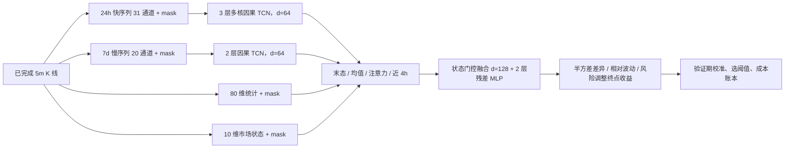
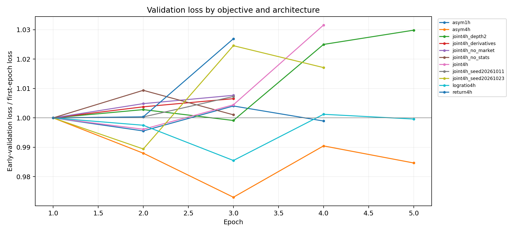
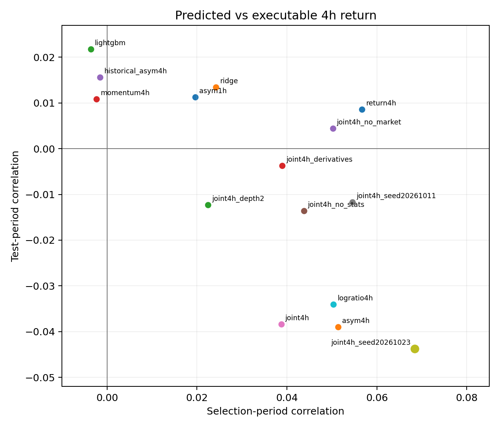
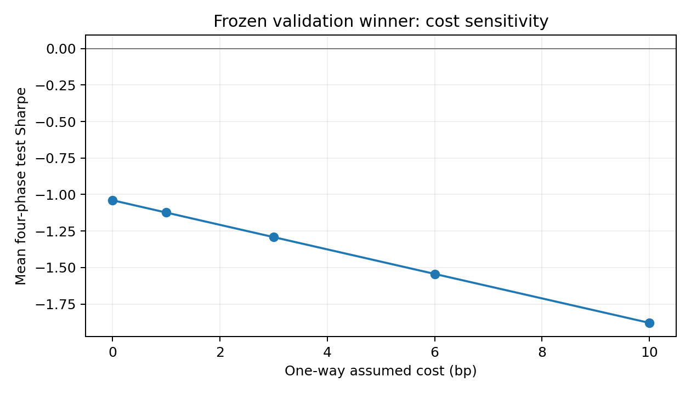
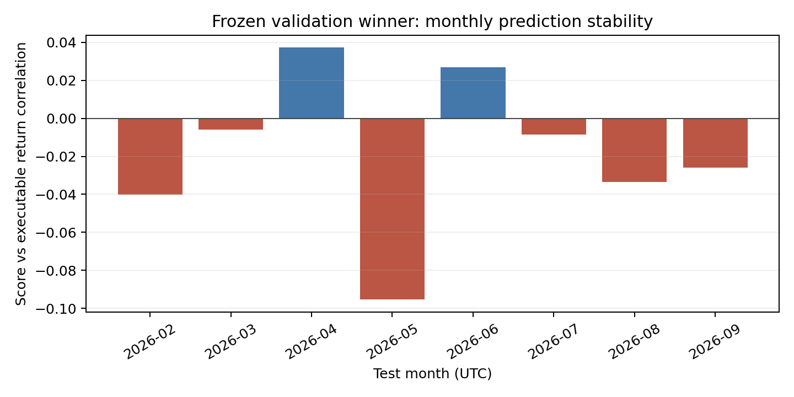

# 12 个永续合约择时网络：训练与冻结测试报告

**研究日期：2026-10-03。结论：当前版本没有获得可部署的样本外择时优势。** 按验证期预先选出的 `logratio4h` 模型，在 2026-02 至 2026-09 的冻结测试期，四个不重叠交易相位的平均净 Sharpe 为 **−1.544**，平均累计收益约 **−15.0%**；四个相位全部亏损。即使把假设的固定交易成本降为零，平均 Sharpe 仍为 **−1.040**。当前应保持空仓研究状态，不能据测试期结果改选看起来较好的模型。

本报告对应 [源代码与运行协议](../../docs/TRAINING_RUNBOOK.md)、[数据审计](../../docs/DATA_AUDIT.md)、[原方案](../../docs/CRYPTO_TIMING_DESIGN.md)。下面的表格和图表从已保存的冻结验证、测试结果生成；原始 Parquet、特征张量和网络权重只留在本机。

## 1. 数据和时间合同

12 个合约分别有 392,544 根连续的 5 分钟 K 线，跨度 2023-01-01 至 2026-09-24 UTC，共 4,710,528 根。没有真实 1 分钟逐笔或订单簿。源 `date` 是开盘时刻，模型只用完整收盘后的 K 线：整点决策、整点后 5 分钟开盘模拟成交、随后持有 48 根 5 分钟 bar。每 4 小时换仓；评估四种起始整点相位，分别计算资金曲线。12 币等权，单币仓位为 −1、0 或 +1；资金不因信号数少而重新集中到少数币。

| 用途 | UTC 决策时间 | `(小时, 合约)` 样本 | 使用规则 |
|---|---|---:|---|
| 训练 | 2023-01-08 01:00 至 2025-06-30 19:00 | 260,580 | 只用标签已在 7 月前成熟的样本；前 7 天用于特征预热 |
| 验证前段 | 2025-07-01 00:00 至 2025-10-31 19:00 | 35,376 | 早停和预测分数的收益校准 |
| 验证后段 | 2025-11-01 00:00 至 2026-01-31 19:00 | 26,448 | 选择模型及固定阈值 |
| 冻结测试 | 2026-02-01 00:00 至 2026-09-24 19:00 | 67,920 | 选择文件封存后评估一次 |

所有资产在同一 UTC 边界划分，无随机交叉验证；交界处清除无法在本段成熟的 4 小时标签。测试数据末端因需要完整 4 小时未来路径而截至 9 月 24 日 19:00 决策。每轮训练只用相邻整点中的一个相位，并逐轮交替，以降低高度重叠标签在单轮中的重复程度；训练仍非独立样本实验。

## 2. 因果特征和模型

**快分支**输入最近 288 根已完成 5 分钟 K 线 × 31 通道：收益、实体与上下影线、区间、成交额/笔数、taker 买卖代理、VWAP 偏离、1/4 小时动量与实现波动、历史半方差差异、成交 surprise、BTC/ETH 状态、12 币市场广度/离散度及 UTC 周期。**慢分支**输入 168 个已完成小时 × 20 通道，覆盖 1 小时到 7 天状态。另有 80 维多窗口统计和 10 维市场状态（含对 BTC 的历史 beta/残差/相关）。没有把 OI、持仓比或缺乏可靠发布时间的链上字段填补成完整历史。

输入按资产、按通道，仅在训练期估计中位数及 `IQR / 1.349`；标准化后截断于 `[−8,8]`。无效值填零时同时提供独立 mask，使网络能区分缺失和真实零。5 分钟快通道在训练段用每小时一个抽样点拟合尺度，应用同一尺度到验证和测试。当前统一用训练期尺度，没有在验证/测试上重新拟合，也没有跨币横截面排序标准化。

标准网络 **214,470 个参数**；快 TCN 核宽 3/9/25，扩张 1/2/4；慢 TCN 核宽 3/9，扩张 1/4。各序列通过末态、均值与 attention **汇聚**，这里没有自注意力主干。多核因果卷积保留局部冲击与数小时持续状态，慢支路捕捉多日条件，显式统计降低小截面数据中仅靠神经网络重建简单波动指标的难度；状态门控让快/慢/统计分支随市场状态改变权重。它保留原 BigAlpha 的多尺度时序、mask、统计与融合思路，但输出是**单合约时点的方向/空仓决策**，不是股票大截面排序。

衍生字段挑战组只在上述 10 个市场通道后加入 6 个因果通道（mark/index 基差及变化、两者收益、上一笔已结算资金费率与 age），参数量 **214,854**。小时 mark/index 在该小时收盘后再延迟 5 分钟可见；funding 结算后再延迟 5 分钟可见。OI、持仓比、链上数据在本次训练中禁用。资金费率历史事件另用于所有策略的事后收益账本。

## 3. 标签、训练和模型选择

对成交后 48 根 5 分钟 bar 的路径收益 $r_i$，令上半方差 $U=\sum\max(r_i,0)^2$，下半方差 $D=\sum\min(r_i,0)^2$，历史波动给出仅从过去计算的 $\epsilon$。核心候选为有界差异 $A=(U-D)/(U+D+2\epsilon)$ 和对数比 $L=\log[(U+\epsilon)/(D+\epsilon)]$。另比较 1 小时 $A$、4 小时风险调整终点收益，以及 $A$、收益、未来相对波动的联合目标。$A$ 与 $L$ 能描述未来路径的上下波动不平衡，但本身不保证可交易终点收益可预测；这是必须由测试确认的假设。

训练使用 RTX 5060 Laptop GPU 8 GB、PyTorch bf16 自动混精、AdamW、学习率 `3e-4`、权重衰减 `1e-4`、batch 256、dropout 0.1、梯度裁剪 1。最多 6 轮，在验证前段连续 2 轮不改善即停；保存每轮 JSONL、最近和最佳检查点、验证预测。实际运行 11 组网络：5 种主目标/标签，联合目标 3 个种子，快 TCN 减为 2 层、去市场分支、去统计分支、加衍生数据的配对挑战。另有 Ridge、LightGBM、两项规则基线、固定持有和空仓。不同目标的损失量纲不同，不以原始损失大小跨目标选模型。

验证前段拟合从预测到**可执行 4 小时对数收益**的线性校准器；验证后段在固定网格 `0 / 0.25 / 0.5 / 1 / 1.5 × 12bp` 上选多空/空仓阈值，要求平均持仓参与率至少 5%，按四相位平均**扣成本 Sharpe**选择候选。主情景单边成本 6bp（手续费 4bp + 滑点 2bp）仅是明示假设，另计历史 funding；模型账本使用线性合约的**简单价格收益** `exp(log return)−1`，平仓成本也计入。最终交易胜者是 `logratio4h_seed20261003`，阈值 ±18bp 校准预期收益；预测相关性最高的是 `joint4h_seed20261023`，两者不能混为一谈。

## 4. 验证选择与独立测试

下表的“验证”指 **2025-11 至 2026-01 选择段**；“测试”指 2026-02 至 2026-09。`corr` 是校准预测分数与 4 小时可执行收益的逐 `(小时,合约)` Pearson 相关，不能视作独立观测的显著性；Sharpe 是四种非重叠 4 小时相位各自 Sharpe 的算术平均。所有候选在验证段各选自己的阈值；**只有加粗的交易胜者属于预先选定的确认性测试**，其他候选的测试数字用于失败诊断，不用于测试后改选。

| 候选 | 验证 corr | 验证净 Sharpe | 测试 corr | 测试净 Sharpe |
|---|---:|---:|---:|---:|
| **4h 对数半方差比，交易胜者** | **+0.050** | **+0.989** | **−0.034** | **−1.544** |
| 4h 有界半方差差异 | +0.051 | +0.897 | −0.039 | −1.929 |
| 1h 有界半方差差异 | +0.020 | −0.918 | +0.011 | −1.447 |
| 4h 风险调整终点收益 | +0.057 | −0.835 | +0.009 | −0.628 |
| 联合目标，种子 20261003 | +0.039 | −0.450 | −0.038 | −2.290 |
| 联合目标，种子 20261011 | +0.055 | −0.367 | −0.012 | −1.821 |
| 联合目标，种子 20261023；预测相关性胜者 | +0.068 | +0.228 | −0.044 | −3.038 |
| 联合目标，快 TCN 2 层 | +0.022 | −0.737 | −0.012 | −1.437 |
| 联合目标，去市场状态 | +0.050 | +0.119 | +0.004 | −0.392 |
| 联合目标，去显式统计 | +0.044 | −0.962 | −0.014 | −0.977 |
| 联合目标，加入已知衍生字段 | +0.039 | −0.601 | −0.004 | −1.270 |
| Ridge | +0.024 | −2.103 | +0.013 | −0.057 |
| LightGBM | −0.004 | −0.895 | +0.022 | −0.935 |
| 历史 4h 动量规则 | −0.002 | −2.144 | +0.011 | +0.300 |
| 历史 4h 半方差规则 | −0.002 | −2.026 | +0.016 | −1.353 |

固定全币做多在验证段净 Sharpe 约 −3.04、测试段 +0.387；空仓两段均为 0。测试中某些基线结果较好，不能代替验证期选择规则。LightGBM 的 4h 半方差与收益头分别只到第 9 和第 3 次迭代即在验证前段早停，提示在这些输入和这个切分下过拟合很快；不能将其解读为“树模型普遍不适合”。加入已知衍生字段的配对挑战未改善验证或测试表现，不支持此处额外通道的价值。去市场状态在测试较少亏损，也不能据此断言市场状态有害，因为这是测试后比较。

交易胜者在验证选择段四相位 Sharpe 分别为 `+2.311 / +0.569 / −0.324 / +1.399`，已经有一相位为负；测试变为 `−1.177 / −1.692 / −2.187 / −1.120`，平均持仓参与率由 6.6% 降至 5.2%。测试四条资金曲线的累计收益分别约 `−11.2% / −17.9% / −20.8% / −10.3%`，其平均约 −15.0%；这个平均仅作相位诊断，**不是**同时运行四个账户的真实组合收益。平均年化对数收益约 −25.4%，年化主要便于口径比较，不应作为未来收益预报。

| 单边假设交易成本 | 0bp | 1bp | 3bp | 6bp 主情景 | 10bp |
|---|---:|---:|---:|---:|---:|
| 冻结策略测试平均 Sharpe | −1.040 | −1.124 | −1.292 | −1.544 | −1.879 |

## 5. 失败机理：标签与交易收益的断层

冻结胜者测试期对**自身未来半方差差异**仍有弱正相关 `+0.0332`，但它经验证前段校准后的交易分数对**可执行终点收益**是 `−0.0340`。测试期事后真实 $A$ 与同一未来可执行收益相关高达 `+0.7539`，这只说明未来路径的半方差不平衡与未来方向机械相关，**不能**倒推模型能事前预测方向。模型预测到的那一小部分 $A$ 信息，未能稳定映射成收益。1 小时 $A$、直接收益目标和联合目标也没有在验证选择与测试两个阶段同时给出可信的可交易优势。

事后诊断按 UTC 连续 **7 日整块**保留跨币和相邻小时相关结构，固定随机种子对测试期做 2,000 次重采样。交易胜者预测 $A$ 对真实 $A$ 的相关区间为 `[+0.004,+0.060]`，分数对可执行收益的区间为 `[−0.069,+0.013]`；后一项跨零，不能据此给出精确的负相关总体结论，但与负收益、零成本仍亏、四相位全负共同表明部署证据不足。这一置信区间是**看完测试后的探索性诊断**，不是新的模型选择。12 个币各自的分数/收益相关均为负，8 个测试月份中 6 个为负，最差的 2026-05 为 `−0.095`，也指向关系缺乏稳定性。

## 6. 研究解释与下一步

1. **标签位置**：半方差比保留为未来路径风险状态的预测辅助头；交易决策的主要目标应直接贴近扣费后可执行收益或条件分布，再用半方差预测作条件/风险控制。先在训练/验证历史上构造严格因果的新实验协议，冻结下一段真正未来数据后再确认，不能在本次测试期重新搜阈值或权重。
2. **验证稳健性**：本次选出的 6.6% 稀疏参与策略在验证四相位中已有一相位为负。下一轮应在训练期内部增加顺序滚动年份/季度折、检查不同市场状态与资产的符号一致性，并将最差相位或跨折稳定性预先写入选择准则。当前测试期不再用于这些规则的择优。
3. **交易可执行性**：6bp/单边与 funding 为情景估计；缺盘口、真实挂单/吃单、延迟、冲击与账户费率。哪怕这些估计偏乐观，零成本亏损已足以否定当前冻结策略；未来模型若出现正收益，仍需独立撮合/成交审计。
4. **研究边界**：只有约 3.7 年、12 个高度相关币和大量重叠 4h 预测。四相位共享同一行情，不能当四个独立的显著性样本；指标没有做多重模型搜索调整。12 币来自现存数据目录，有潜在事后成分选择偏差。少量零成交 bar 留在标签路径中，实际可交易性未逐笔核验。

## 7. 复核与保存

- 冻结前选择文件原始 SHA-256：`fa295cb9407f9e31bae8326da78b40322643fbe91ef67539b882a218924650a2`。发布版 JSON 将无定义的诊断相关 `NaN` 转为标准 JSON `null`，其余数值不变；[源文件哈希表](source_hashes.json)记录本地原始文件哈希。
- [训练组、最佳 epoch 与检查点哈希](training_runs.json)、[基线摘要](baselines_summary.json)、[主缓存合同](cache_v1_manifest.json)、[衍生挑战缓存合同](cache_v2_manifest.json)、[验证选择全表](selection.json)、[冻结测试全表](final_test.json)、[事后标签诊断](post_test_diagnostics.json)均为可读的紧凑产物。
- 本机 `outputs/models/<实验名>/` 保存 `best.pt`、`last.pt`、`history.jsonl`、验证预测及日志；`outputs/cache_v1/`、`outputs/cache_v2/` 保存特征仓；`outputs/evaluation/` 保存原始冻结 JSON、测试预测与诊断。大体积原始数据、缓存和权重不提交 GitHub。
- 复现入口依次为 `scripts/build_cache.py`、`scripts/build_derivative_cache.py`、`scripts/run_baselines.py`、`scripts/run_experiments.ps1` 与衍生挑战训练、`scripts/select_models.py`、`scripts/final_test.py`。测试诊断/公开图表由 `scripts/diagnose_frozen_test.py`、`scripts/publish_results.py`、`scripts/build_figures.py` 生成。详细命令见[训练协议](../../docs/TRAINING_RUNBOOK.md)。

**本次决策：不部署模型，不依据测试期另选候选，保留冻结结果作为下一轮研究的失败基准。**
